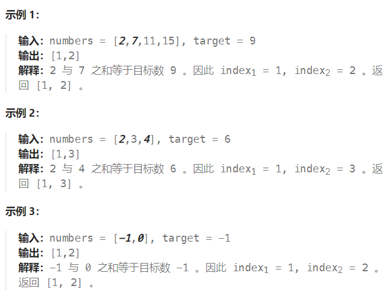

题目：

给你一个下标从 **1** 开始的整数数组 `numbers` ，该数组已按 **非递减顺序排列** ，请你从数组中找出满足相加之和等于目标数 `target` 的两个数。如果设这两个数分别是 `numbers[index1]` 和 `numbers[index2]` ，则 `1 <= index1 < index2 <= numbers.length` 。

以长度为 2 的整数数组 `[index1, index2]` 的形式返回这两个整数的下标 `index1` 和 `index2`。

你可以假设每个输入 **只对应唯一的答案** ，而且你 **不可以** 重复使用相同的元素。

你所设计的解决方案必须只使用常量级的额外空间。



题解：

因为题目要求只能使用**常数级别的额外空间**，因此不能使用递归法实现。

该题目有两种解决方案： 1. 二分法    2. 双指针

### 解法一：二分法

```go
func twoSum(numbers []int, target int) []int {
    for i:=0; i<len(numbers); i++ {   // 用 i 来固定作为第一个数，二分法确定第二个数
        // 第二个数的取值范围是: [i+1, len(numbers) - 1]
        left := i + 1
        right := len(numbers) - 1
        mid := 0
        for left <= right {
            mid = left + (right - left) / 2
            if numbers[mid] == target - numbers[i] {
                return []int{i+1, mid+1}
            } else if numbers[mid] < target - numbers[i] {
                left = mid + 1
            } else if numbers[mid] > target - numbers[i] {
                right = mid - 1
            }
        }
    }
    return []int{-1, -1}
}
```

### 解法二：双指针

**初始时两个指针分别指向第一个元素位置和最后一个元素的位置**。每次计算两个指针指向的两个元素之和，并和目标值比较：

- 如果两个元素之和**等于**目标值，则发现了**唯一解**。
- 如果两个元素之和**小于**目标值，则将**左侧指针右移**一位。
- 如果两个元素之和**大于**目标值，则将**右侧指针左移**一位。
- 移动指针之后，重复上述操作，直到找到答案。

使用双指针的实质是缩小查找范围。那么会不会把可能的解过滤掉？答案是不会。假设 **`numbers[i]+numbers[j]=target` 是唯一解**，其中` 0≤i<j≤numbers.length−1` 。**初始时两个指针分别指向下标 0 和下标 `numbers.length−1` ，左指针指向的下标小于或等于 i ，右指针指向的下标大于或等于 j** 。除非初始时左指针和右指针已经位于下标 i 和 j ，否则**一定是左指针先到达下标 i 的位置或者右指针先到达下标 j 的位置**。

- 如果**左指针先到达下标 i 的位置**，此时右指针还在下标 j 的右侧，sum > target ，因此一定是右指针左移，左指针不可能移到 i 的右侧。

- 如果**右指针先到达下标 j 的位置**，此时左指针还在下标 i 的左侧，sum<target ，因此一定是左指针右移，右指针不可能移到 j 的左侧。


由此可见，在整个移动过程中，**左指针不可能移到 i 的右侧，右指针不可能移到 j 的左侧**，因此**不会把可能的解过滤掉**。由于题目**确保有唯一的答案**，因此使用双指针一定可以找到答案。

```go
func twoSum(numbers []int, target int) []int {
    left, right := 0, len(numbers) - 1
    for left < right {
        if numbers[left] + numbers[right] == target {
            return []int{left+1, right+1}
        } else if numbers[left] + numbers[right] > target {   // 如果不等的原因是: right指向的元素太大，那么right左移
            right--
        } else {   // 不等的原因：left指向的元素太小，那么left右移
            left++
        }
    }
    return []int{-1,-1}
}
```

