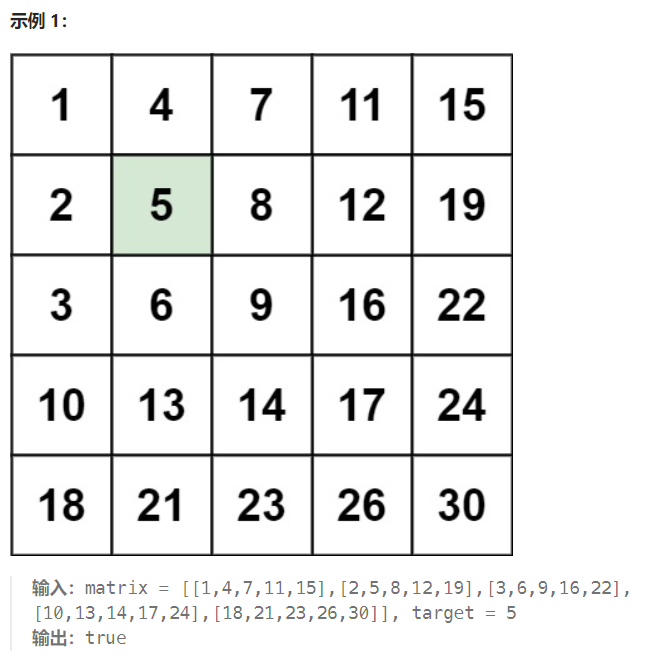

题目：

编写一个高效的算法来搜索 `m * n ` 矩阵 `matrix` 中的一个目标值 `target` 。该矩阵具有以下特性：

- 每行的元素从左到右升序排列。
- 每列的元素从上到下升序排列。



题解：

#### 解法一：二分查找

```go
func searchMatrix(matrix [][]int, target int) bool {
    rowMax := len(matrix) - 1
    colMax := len(matrix[0]) - 1
    
    colMid := 0

    for row:=0; row <= rowMax; row++ {
        if matrix[row][0] > target || matrix[row][colMax] < target {
            continue
        }

        left, right := 0, colMax
        for left <= right {
            colMid = left + (right - left) / 2
            if matrix[row][colMid] == target {   // 找到了该元素
                return true
            } else if matrix[row][colMid] < target {   // target 在右半区域
                left = colMid + 1
            } else if matrix[row][colMid] > target {   // target 在左半区域
                right = colMid - 1
            }
        }
    }
    return false
}
```

#### 解法二：Z 字形查找

我们可以从矩阵 matrix 的右上角 (0,n−1) 进行搜索。在每一步的搜索过程中，如果我们位于位置 (x,y) ，那么我们希望在**以 matrix 的左下角为左下角、以 (x,y) 为右上角的矩阵**中进行搜索，即**行的范围为 [x,m−1]** ，**列的范围为 [0,y]** 。在过程中，**(x,y) 只能往下或者往左移动**。

- 如果 matrix[x,y]=target ，说明搜索完成；

- 如果 matrix[x,y]>target ，由于**每一列的元素都是升序排列**的，那么在当前的搜索矩阵中，所有位于**第 y  列的元素都是严格大于 target 的**，因此我们可以将它们全部忽略，所以不能往下只能往左，即将 y 减少 1 ；

- 如果 matrix[x,y]<target ，由于**每一行的元素都是升序排列**的，那么在当前的搜索矩阵中，所有位于**第 x 行的元素都是严格小于 target 的**，因此我们可以将它们全部忽略，所以只能往下不能往左，即将 x 增加 1 。


```go
func searchMatrix(matrix [][]int, target int) bool {
    m, n := len(matrix), len(matrix[0])
    x, y := 0, n-1
    for x < m && y >= 0 {
        if matrix[x][y] == target {
            return true
        }
        if matrix[x][y] > target {
            y--
        } else {
            x++
        }
    }
    return false
}
```

