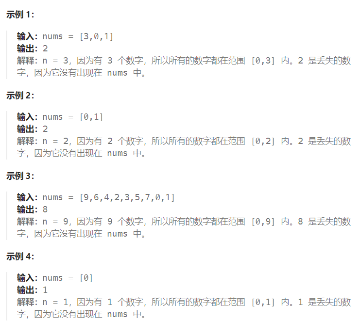
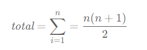

题目：

给定一个包含 `[0, n]` 中 `n` 个数的数组 `nums` ，找出 `[0, n]` 这个范围内没有出现在数组中的那个数。



题解：

**本题并不能使用二分法解决。**

#### 方法一：排序

将数组排序之后，即可根据数组中每个下标处的元素是否和下标相等，得到丢失的数字。

由于数组的长度是 n ，因此下标范围是 [0,n−1] 。假设缺失的数字是 k ，分别考虑以下两种情况：

- 当 0≤k<n 时，对任意 0≤i<k ，都有 nums[i]=i ，**由于 k 缺失，因此 nums[k]=k+1 ，k 是第一个满足下标和元素不相等的下标**；

- 当 k=n 时，0 到 n−1 都没有缺失，因此对任意 0≤i<n ，都有 nums[i]=i 。

根据上述两种情况，可以得到如下方法得到丢失的数字：

- 从左到右遍历数组 nums ，如果存在 0≤i<n0 使得 nums[i]≠i ，则缺失的数字是满足 nums[i]≠i 的最小的 i ；

- 如果对任意 0≤i<n0 ，都有 nums[i]=i ，则缺失的数字是 n 。

```go
func missingNumber(nums []int) int {
    sort.Ints(nums)
    for i:=0; i<len(nums); i++ {
        if i != nums[i] {
            return i
        }
    }
    return len(nums)
}
```

#### 方法二：哈希表

使用哈希集合，可以将时间复杂度降低到 O(n) 。

首先遍历数组 nums ，将数组中的每个元素加入哈希集合，然后依次检查从 0 到 n 的每个整数是否在哈希集合中，不在哈希集合中的数字即为丢失的数字。由于哈希集合的每次添加元素和查找元素的时间复杂度都是 O(1) ，因此总时间复杂度是 O(n) 。

```go
func missingNumber(nums []int) int {
    has := map[int]bool{}
    for _, v := range nums {
        has[v] = true
    }
    for i := 0; ; i++ {
        if !has[i] {
            return i
        }
    }
```

#### 方法三：数学

将从 0 到 n 的全部整数之和记为 total ，根据高斯求和公式，有：



将数组 nums 的元素之和记为 arrSum ，则 arrSum 比 total 少了丢失的一个数字，因此丢失的数字即为 total 与 arrSum 之差。

```go
func missingNumber(nums []int) int {
    n := len(nums)
    total := n * (n + 1) / 2
    arrSum := 0
    for _, num := range nums {
        arrSum += num
    }
    return total - arrSum
}
```

