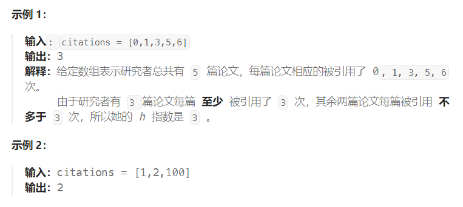

题目：

给你一个整数数组 `citations` ，其中 `citations[i]` 表示研究者的第 `i` 篇论文被引用的次数，`citations` 已经按照 **升序排列** 。计算并返回该研究者的 h 指数。

[h 指数的定义](https://baike.baidu.com/item/h-index/3991452?fr=aladdin)：h 代表“高引用次数”（high citations），一名科研人员的 `h` 指数是指他（她）的 （`n` 篇论文中）**总共**有 `h` 篇论文分别被引用了**至少** `h` 次。

请你设计并实现对数时间复杂度的算法解决此问题。



题解：

这是一个求**有序数组左侧边界**的**二分查找**问题。

```go
func hIndex(citations []int) int {
    n := len(citations)
    h := 0
    left, right := 0, n - 1
    for left <= right {
        mid := (right + left) / 2
        if citations[mid] >= n - mid {    // 引用次数 >= 论文数量(符合条件，但不一定是最优)。向左侧缩小
            right = mid - 1
            h = n - mid    // h指数至少是论文数量 n - mid
        } else {    // 向右侧缩小
            left = mid + 1
        }
    }
    return h
}
```

