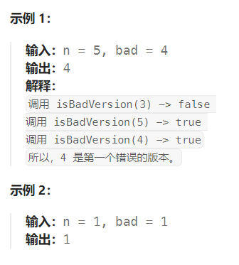

题目：

你是产品经理，目前正在带领一个团队开发新的产品。不幸的是，你的产品的最新版本没有通过质量检测。由于每个版本都是基于之前的版本开发的，所以错误的版本之后的所有版本都是错的。

假设你有 `n` 个版本 `[1, 2, ..., n]`，你想找出导致之后所有版本出错的第一个错误的版本。

你可以通过调用 `bool isBadVersion(version)` 接口来判断版本号 `version` 是否在单元测试中出错。实现一个函数来查找第一个错误的版本。你应该尽量减少对调用 API 的次数。



题解：

这是一道关于二分法查找最左边界的问题。

```go
func firstBadVersion(n int) int {
    left, right := 1,n
    mid := 0

    first := n

    for left <= right {
        mid = left + (right - left) / 2
        if isBadVersion(mid) {   // 如果当前版本已错误，需要继续到左侧查找最早出现错误的版本
            right = mid - 1
            first = mid
        } else {    // 如果当前版本正确，需要看右侧的版本是否有错误
            left = mid + 1
        }
    }

    return first
}
```

