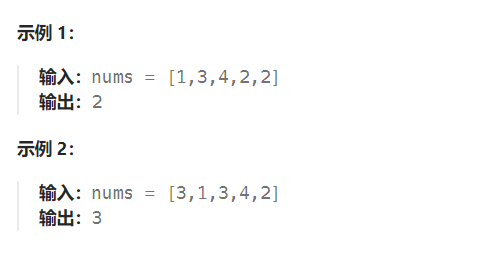
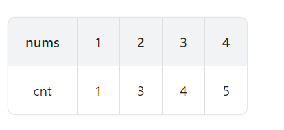

题目：

给定一个包含 `n + 1` 个整数的数组 `nums` ，其数字都在 `[1, n]` 范围内（包括 `1` 和 `n`），可知至少存在一个重复的整数。

假设 `nums` 只有 **一个重复的整数** ，返回 **这个重复的数** 。

你设计的解决方案必须 **不修改** 数组 `nums` 且只用常量级 `O(1)` 的额外空间。



题解：

我们定义 `cnt[i]` 表示 `nums` 数组中小于等于 i 的元素个数，假设我们重复的数是 target ，那么 `[1,target−1]` 里的所有数满足 `cnt[i]≤i` ，`[target,n]` 里的所有数满足 `cnt[i]>i` ，具有单调性。

以示例 1 （`nums = [ 1 3 4 2 2]` ）为例，我们列出每个数字的 cnt 值：



示例中重复的整数是 2 ，我们可以看到 [1,1] 中的数满足 cnt[i]≤i ，[2,4] 中的数满足 cnt[i]>i 。

如果知道 cnt[] 数组随数字  i 逐渐增大具有单调性（即 target 前 cnt[i]≤i ，target 后 cnt[i]>i ），那么我们就可以直接利用二分查找来找到重复的数。

```go
func findDuplicate(nums []int) int {
    n := len(nums)
    l, r := 1, n - 1
    ans := -1
    for l <= r {
        mid := (l + r) >> 1
        cnt := 0
        for i := 0; i < n; i++ {   // 统计整个 nums 数组中, 小于等于当前mid的元素个数
            if nums[i] <= mid {
                cnt++
            }
        }
        if cnt <= mid {   // 满足 cnt[i] <= i 那么说明当前mid位于target的左侧
            l = mid + 1   // 需要到右侧继续查找
        } else {		// 满足 cnt[i] > i 那么说明当前mid位于target的右侧
            r = mid - 1   // 需要到左侧继续查找
            ans = mid   // 需要找到重复出现的原始位置(因此此题也是一个二分查找最左边界的问题)
        }
    }
    return ans
}
```

