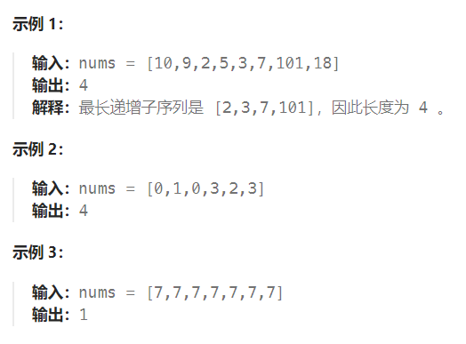

题目：

给你一个整数数组 `nums` ，找到其中最长严格递增子序列的长度。

**子序列** 是由数组派生而来的序列，删除（或不删除）数组中的元素而不改变其余元素的顺序。例如，`[3,6,2,7]` 是数组 `[0,3,1,6,2,2,7]` 的子序列。



题解：

考虑一个简单的贪心，**如果我们要使上升子序列尽可能的长**，则我们**需要让序列上升得尽可能慢**，因此我们希望**每次在上升子序列最后加上的那个数尽可能的小**。

基于上面的贪心思路，我们维护一个数组 d[i] ，表示长度为 i 的最长上升子序列的末尾元素的最小值，用 len 记录目前最长上升子序列的长度，起始时 len 为 1 ，d[1]=nums[0] 。

我们依次遍历数组 nums 中的每个元素，并更新数组 d 和 len 的值。

- 如果 nums[i]>d[len] 则更新 len=len+1 
- 否则在 d[1…len] 中找第一个(最左侧)满足 d[i−1]<nums[j]<=d[i] 的下标 i ，并更新 d[i]=nums[j] 。

最后整个算法流程为：

- 设当前已求出的最长上升子序列的长度为 len （初始时为 1 ），从前往后遍历数组 nums ，在遍历到 nums[i] 时：

  - 如果 nums[i]>d[len]  ，则直接加入到 d 数组末尾，并更新 len=len+1 ；


  - 否则，在 d 数组中二分查找，找到第一个大于等于 nums[i] 的数 d[k] ，并更新 d[k]=nums[i] 。


以输入序列 [0,8,4,12,2] 为例：

第一步插入 0 ，d=[0] ；

第二步插入 8 ，d=[0,8] ；

第三步插入 4 ，d=[0,4] ；

第四步插入 12 ，d=[0,4,12] ；

第五步插入 2 ，d=[0,2,12] 。

最终得到最大递增子序列长度为  3。

```go
func lengthOfLIS(nums []int) int {
    if len(nums) == 1 {
        return 1
    }

    d := make([]int, 0)   // 记录最长严格递增子序列

    for i:=0; i<len(nums); i++ {
        if len(d) == 0 {    // d当前为空，则直接将nums[]首元素追加到其中
            d = append(d, nums[0])
        }
        // 当前 nums[i] > d的末尾元素，就可以直接追加到nums[]中
        if nums[i] > d[len(d) - 1] {   
            d = append(d, nums[i])
        }
        // 当前 nums[i] < d的末尾元素, 需要用 nums[i] 取代大于等于 d[k] 的第一个数(贪心策略:让d[k]尽可能的小)
        if nums[i] < d[len(d) - 1] {  
            left, right := 0, len(d) - 1
            mid := 0
            targetIndex := -1
            for left <= right {
                mid = left + (right - left) / 2
                if nums[i] <= d[mid] {   // nums[i] 比当前中点值要小或者等于，那么向左缩小
                    right = mid-1
                    targetIndex = mid
                } else {    // nums[i] 比当前中点值要大，那么向右缩小
                    left = mid + 1
                }
            }
            d[targetIndex] = nums[i]
            
        }
    }
    return len(d)
}
```

