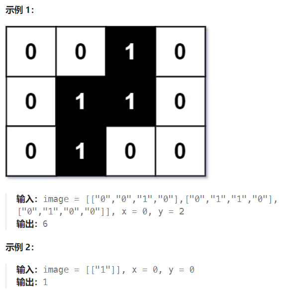

题目：

图片在计算机处理中往往是使用二维矩阵来表示的。

给你一个大小为 `m x n` 的二进制矩阵 `image` 表示一张黑白图片，`0` 代表白色像素，`1` 代表黑色像素。

黑色像素相互连接，也就是说，图片中只会有一片连在一块儿的黑色像素。像素点是水平或竖直方向连接的。

给你两个整数 `x` 和 `y` 表示某一个黑色像素的位置，请你找出包含全部黑色像素的最小矩形（与坐标轴对齐），并返回该矩形的面积。

你必须设计并实现一个时间复杂度低于 `O(mn)` 的算法来解决此问题。



题解：

### 方法一: 二分查找

**关键点一**：将 2D 图像投影到一个 1D 数组中，然后使用二分查找找到边界。


关键点二：这是一个二分查找获取左右边界的问题，那么边界具体怎么获取呢？

- 将 2D 数组投影到一个列数组和一个行数组中。

- 二分查找在 [0, y-1] 中找到 left。
- 二分查找在 [y + 1, n-1] 中找到 right。
- 二分查找在 [0, x+1] 中找到 top。
- 二分查找在 [x + 1, m-1] 中找到 bottom。
- 返回 (right - left + 1) * (bottom - top + 1)

```go
func minArea(image [][]byte, x int, y int) int {
    rowMax := len(image) - 1
    colMax := len(image[0]) - 1

    // 列投影
    colSet := make([]byte, colMax + 1)
    // 行投影
    rowSet := make([]byte, rowMax + 1)

    for col:=0; col <= colMax; col++ {
        for row:=0; row <= rowMax; row++ {
            if image[row][col] == '1' {
                colSet[col] = '1'
                rowSet[row] = '1'
            }
        }
    }

    // 1.在 [0, y-1]上获取黑像素左边界
    left, right := 0, y-1
    mid := 0
    mostLeft := y   // 左右边界默认就是y
    for left <= right {
        mid = left + (right - left) /2
        if colSet[mid] == '1' {   // 是黑像素，那么向左缩减
            right = mid - 1
            mostLeft = mid
        } else {   // 是白像素, 那么向右缩减
            left = mid + 1
        }
    }

    // 2.在 [y+1, colMax]上获取黑像素右边界
    left, right = y+1 , colMax
    mostRigth := y
    for left <= right {
        mid = left + (right - left) /2
        if colSet[mid] == '1' {   // 是黑像素，那么向右缩减
            left = mid + 1
            mostRigth = mid
        } else {   // 是白像素, 那么向左缩减
            right = mid - 1
        }
    }

    // 3.在 [0, x-1]上获取黑像素上边界
    up, down := 0, x-1
    mostUp := x    // 上下边界默认就是x
    for up <= down {
        mid = up + (down - up) /2
        if rowSet[mid] == '1' {   // 是黑像素，那么向上缩减
            down = mid - 1
            mostUp = mid
        } else {   // 是白像素, 那么向下缩减
            up = mid + 1
        }
    }
    // 4.在 [y+1, rowMax]上获取黑像素下边界 
    up, down = x, rowMax
    mostDown := x
    for up <= down {
        mid = up + (down - up) /2
        if rowSet[mid] == '1' {   // 是黑像素，那么向下缩减
            up = mid + 1
            mostDown = mid
        } else {   // 是白像素, 那么向上缩减
            down = mid - 1
        }
    }

    length := mostRigth - mostLeft + 1
    width := mostDown - mostUp + 1

    return length * width
}
```

