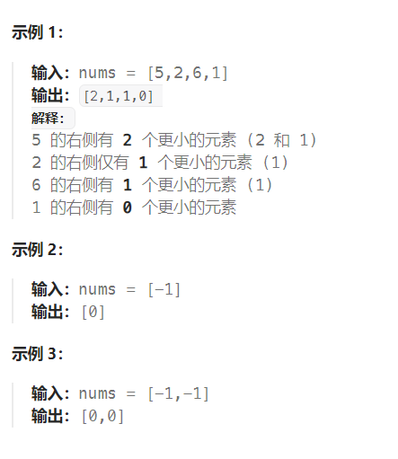

题目：

给你一个整数数组 `nums` ，按要求返回一个新数组 `counts` 。数组 `counts` 有该性质： `counts[i]` 的值是 `nums[i]` 右侧小于 `nums[i]` 的元素的数量。



题解：

使用**归并排序**的做法完成此题。注意：此题进行排序的对象不是数值数组本身，而需要是对**索引数组**进行归并排序。

```go
func countSmaller(nums []int) []int {
    res := make([]int, len(nums))   // 存放最终的返回结果
    indexes := make([]int, len(nums))   // 下标数组，后续我们对下标数组进行归并排序
    for i:=0; i<len(nums); i++ {
        indexes[i] = i
    }
    temp := make([]int, len(nums))  // 在进行每一轮归并时,需要现有temp临时存储indexes未归并前的数值

    mergeSort(nums, 0, len(nums) - 1, indexes, temp, res)
    return res
}

func mergeSort(nums []int, left, right int, indexes []int, temp []int, res []int) {
    if left == right {   // 区域只有一个数字，不需要进行排序
        return
    }

    mid := left + (right - left) / 2
    mergeSort(nums, left, mid, indexes, temp, res)   // 左半区域，[left,mid]
    mergeSort(nums, mid+1, right, indexes, temp, res)   // 右半区域, [mid+1, right]
    
    // 左半区域的最大数 <= 右半区域的最小数。那么已经是有序的了,不需要在进行归并
    if (nums[indexes[mid]] <= nums[indexes[mid + 1]]) {  
        return
    }
    
    merge(nums,left, right, indexes, temp, res)
}

func merge(nums []int, left, right int, indexes []int, temp []int, res []int) {
    // 复制indexes数组内容到temp数组。
    // 注意：这里不能用for进行O(N)的复制，必须使用copy进行复制，否则会超时。
    copy(temp[left:right+1], indexes[left:right+1])   

    mid := left + (right - left) / 2
    leftIndex := left
    rightIndex := mid + 1

    // 重新对下标数组进行排序，即: 进行左右归并
    for k:=left; k<=right; k++ {
        if leftIndex > mid {    // 左半区域已经遍历完毕，剩下只需要将右半区域剩余的归并进来即可
            indexes[k] = temp[rightIndex]
            rightIndex++
        } else if rightIndex > right {   // 右半区域已经遍历完毕，对左半区域剩余进行归并
            indexes[k] = temp[leftIndex]
            leftIndex++
            // temp[leftIndex]代表的数一定大于 mid+1 ~ right 之间（整个右半区域）代表的数字
            res[indexes[k]] += (right - mid)  
        } else if nums[temp[leftIndex]] <= nums[temp[rightIndex]] {   // 左半区域的数字要小
            indexes[k] = temp[leftIndex]   // 代表小的那个数值的下标往前排
            leftIndex++
            // temp[leftIndex]代表的数一定大于 mid+1 ~ temp[rightIndex] - 1 之间代表的数字
            res[indexes[k]] += rightIndex - mid - 1 // (rightIndex - 1 - (mid+1) + 1 )
        } else {   // 右半区域的数字要小
            indexes[k] = temp[rightIndex]
            rightIndex++
        }
    }
}
```

或者：

```go
func countSmaller(nums []int) []int {
    n := len(nums)
    //索引数组
    indexs := make([]int, n)
    for i:=0;i<len(nums);i++ {
        indexs[i] = i 
    }
    //结果数组
    result := make([]int, n)
    //暂存数组（只存排序结果的原始下标，并不真正对nums进行排序）
    tmp := make([]int, n)
    mergeSort(0, n-1, nums, tmp, result, indexs)

    return result
}

func mergeSort(start, end int, nums, tmp, result, indexs []int) {
    if start >= end {
        return 
    }

    mid := start + (end - start) >> 1
    //后序遍历框架
    mergeSort(start, mid, nums, tmp, result, indexs)
    mergeSort(mid+1, end, nums, tmp, result, indexs)

    //l1：访问左边数组的起始下标，l2：访问访问右边数组的起始下标
    l1, l2 := start, mid + 1
    //t：访问tmp的起始下标
    t := start
    for l1 <= mid && l2 <= end {
        if nums[indexs[l1]] <= nums[indexs[l2]] {
            tmp[t] = indexs[l1]
            result[indexs[l1]] += l2 - mid - 1
            t++; l1++
        } else {
            tmp[t] = indexs[l2]
            t++; l2++
        }
    }

    //补上l1-mid
    for l1 <= mid {
        tmp[t] = indexs[l1]
        //左数组有的剩，说明比右数组的都要大，再更新result
        result[indexs[l1]] += end - mid
        t++; l1++
    }

    //补上l2-end
    for l2 <= end {
        tmp[t] = indexs[l2]
        t++; l2++
    }

    //将暂存数组赋给indexs，作为新的索引数组，也代表排序
    copy(indexs[start:end+1], tmp[start:end+1])

}
```

