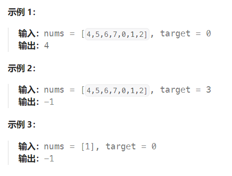
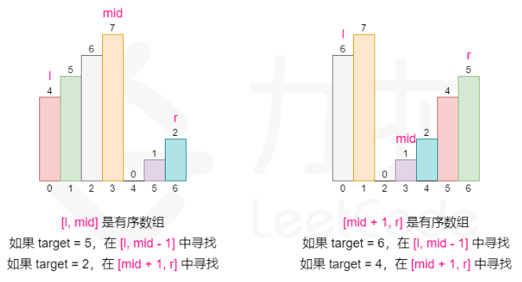

题目：

整数数组 `nums` 按升序排列，数组中的值 **互不相同** 。

在传递给函数之前，`nums` 在预先未知的某个下标 `k`（`0 <= k < nums.length`）上进行了 **旋转**，使数组变为 `[nums[k], nums[k+1], ..., nums[n-1], nums[0], nums[1], ..., nums[k-1]]`（下标 **从 0 开始** 计数）。例如， `[0,1,2,4,5,6,7]` 在下标 `3` 处经旋转后可能变为 `[4,5,6,7,0,1,2]` 。

给你 **旋转后** 的数组 `nums` 和一个整数 `target` ，如果 `nums` 中存在这个目标值 `target` ，则返回它的下标，否则返回 `-1` 。

你必须设计一个时间复杂度为 `O(log n)` 的算法解决此问题。



题解：

对于**有序数组**，可以使用**二分查找**的方法查找元素。

但是这道题中，**数组本身不是有序的**，进行旋转后**只保证了数组的局部是有序的**，这还能进行二分查找吗？**答案是可以的**。

可以在常规二分查找的时候查看当前 mid 为分割位置分割出来的**两个部分 [l, mid] 和 [mid + 1, r]**。具体**去判断哪个部分是有序的**，并**根据有序的那个部分确定我们该如何改变二分查找的上下界**，因为我们能够根据有序的那部分判断出 target 在不在这个部分：

- 如果 [l, mid - 1] 是有序数组，且 target 的大小满足 [nums[l],nums[mid]) ，则我们应该将搜索范围缩小至 [l, mid - 1]，否则在 [mid + 1, r] 中寻找。

- 如果 [mid, r] 是有序数组，且 target 的大小满足 (nums[mid+1],nums[r]] ，则我们应该将搜索范围缩小至 [mid + 1, r]，否则在 [l, mid - 1] 中寻找。



需要注意的是，二分的写法有很多种，所以在判断 `target` 大小与有序部分的关系的时候可能会出现细节上的差别。

```go
func search(nums []int, target int) int {
    left, right := 0, len(nums) - 1
    for {
        if left > right {
            break
        }
        mid := left + (right - left) / 2
        if target == nums[mid] {
            return mid
        }
        // 左右必定存在至少一个有序数组
        if  (left <= mid - 1) && nums[left] <= nums[mid - 1] {   // 说明左侧是有序数组（left <= mid - 1 防止 nums[mid - 1] 访问溢出）
            if nums[left] <= target && target <= nums[mid - 1] {   // target位于左侧区域中
                right = mid - 1   // 下一步就到左侧区域查找
            } else {   // target不在左侧区域，那么到右侧区域查找
                left = mid + 1
            }
        } else  {   // 左侧不是有序数组，那么右侧必然是有序数组
            if (mid + 1 <= right) && nums[mid + 1] <= target && target <= nums[right] {   // target位于右侧区域( 这里判断 mid + 1 <= right 是为了防止 nums[]访问 nums[mid + 1]时发生溢出 )
                left = mid + 1
            } else {  // target不在右侧区域，那么到左侧区域查找
                right = mid - 1
            }
        }
    }
    return -1
}
```

