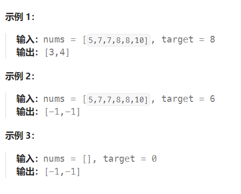

题目：

给你一个按照非递减顺序排列的整数数组 `nums`，和一个目标值 `target`。请你找出给定目标值在数组中的开始位置和结束位置。

如果数组中不存在目标值 `target`，返回 `[-1, -1]`。

你必须设计并实现时间复杂度为 `O(log n)` 的算法解决此问题。



题解：

```go
class Solution {
    public int[] searchRange(int[] nums, int target) {
        int left = 0;
        int right = nums.length - 1;

        int mostLeft = -1;
        int mostRight = -1;
		
        // 先找左边界
        while (left <= right) {
            int mid = left + (right - left) /2;
            if (nums[mid] < target) {
                left = mid + 1;
            } else if (nums[mid] > target) {
                right = mid -1;
            } else {
                mostLeft = mid;
                right = mid - 1;   // 还要继续向左找左边界
            }
        }

        // 再找右边界
        left = 0;
        right =nums.length - 1;   

        while (left <= right) {
            int mid = left + (right - left) /2;
            if (nums[mid] > target) {
                right = mid - 1;
            } else if (nums[mid] < target) {
                left = mid + 1;
            } else {
                mostRight = mid;
                left = mid + 1;  // 还要继续向右找有边界
            }
        }

        int[] res = new int[2];
        res = new int[]{mostLeft, mostRight};
        
        return res;
    }
}
```

