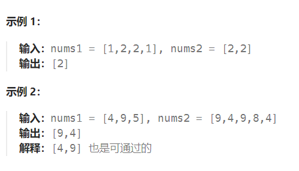

题目：

给定两个数组 `nums1` 和 `nums2` ，返回 **它们的交集**  。输出结果中的每个元素一定是 **唯一** 的。我们可以 **不考虑输出结果的顺序** 。



题解：

**排序 + 二分查找**

```go
func intersection(nums1 []int, nums2 []int) []int {
    res := make([]int,0)
    sort.Ints(nums1)
    sort.Ints(nums2)
    singleShort := make([]int,0)   // 存储较短数组的所有不重复元素

    if len(nums1) > len(nums2) {   // nums2[]较短,singleShort存储nums2的不重复元素
        for i:=0;i<len(nums2);i++ {
            if len(singleShort) == 0 {
                singleShort = append(singleShort, nums2[i])
            } else {
                if nums2[i] > singleShort[len(singleShort) - 1] {   // singleShort 必须是严格升序的
                    singleShort = append(singleShort, nums2[i])
                }
            }
        }
        // 遍历singleShort的每一个元素，看在 num1中是否有重复元素
        for i:=0;i<len(singleShort);i++ {   
            target := singleShort[i]
            left,right := 0,len(nums1)-1
            mid := 0
            for left <= right {
                mid = left + (right - left) / 2
                if target == nums1[mid] {
                    res = append(res, target)
                    break
                } else if target < nums1[mid] {
                    right = mid - 1
                } else if nums1[mid] < target {
                    left = mid + 1
                }
            }
        }
    } else {     // nums1[]较短,singleShort存储nums1的不重复元素
        for i:=0;i<len(nums1);i++ {
            if len(singleShort) == 0 {
                singleShort = append(singleShort, nums1[i])
            } else {
                if nums1[i] > singleShort[len(singleShort) - 1] {   // singleShort 必须是严格升序的
                    singleShort = append(singleShort, nums1[i])
                }
            }
        }
        // 遍历singleShort的每一个元素，看在 num2 中是否有重复元素
        for i:=0;i<len(singleShort);i++ {  
            target := singleShort[i]
            left,right := 0,len(nums2)-1
            mid := 0
            for left <= right {
                mid = left + (right - left) / 2
                if target == nums2[mid] {
                    res = append(res, target)
                    break
                } else if target < nums2[mid] {
                    right = mid - 1
                } else if nums2[mid] < target {
                    left = mid + 1
                }
            }
        }
    }
    return res
}
```

