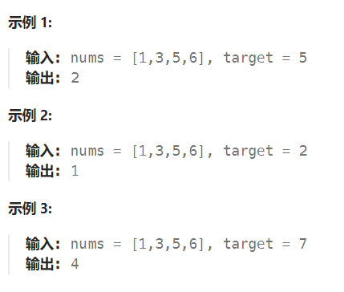
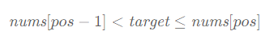

题目：

给定一个排序数组和一个目标值，在数组中找到目标值，并返回其索引。如果目标值不存在于数组中，返回它将会被按顺序插入的位置。

请必须使用时间复杂度为 `O(log n)` 的算法。



题解：

本题目除了要找到目标值在数组中的下标，还多了个额外的条件，即**如果不存在数组中的时候需要返回按顺序插入的位置**。

那我们还能用二分法么？答案是可以的，我们只需要稍作修改即可。

考虑这个**插入的位置 pos** ，它成立的条件为：



其中 nums 代表排序数组。由于**如果存在这个目标值，我们返回的索引也是 pos** ，因此我们**可以将两个条件合并**得出最后的目标：「在一个有序数组中找**第一个(也即最左侧的)大于等于 target 的下标**」。

```go
func searchInsert(nums []int, target int) int {
    n := len(nums)
    left, right := 0, n - 1
    ans := n    // ans是从右向左更新的，因此初始值可以设置为n(target比nums[]中所有数字都大时，就需要向 len(nums) 位置插入target)
    for left <= right {
        mid := (right - left) >> 1 + left
        if target <= nums[mid] {
            ans = mid   // ans记录大于等于target的数字
            right = mid - 1		// 区间继续向左侧缩小
        } else {
            left = mid + 1
        }
    }
    return ans
}
```

