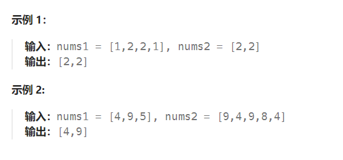

题目：

给你两个整数数组 `nums1` 和 `nums2` ，请你以数组形式返回两数组的交集。

返回结果中每个元素出现的次数，应与元素在两个数组中都出现的次数一致（如果出现次数不一致，则考虑取较小值）。

可以**不考虑输出结果的顺序**。



题解：

```go
func intersect(nums1 []int, nums2 []int) []int {
    res := []int{}

    sort.Ints(nums1)
    sort.Ints(nums2)

    singleNum1 := []int{}   // 记录nums1的严格单增序列（nums1[i-1] < nums1[i]）
    singleNum2 := []int{}   // 记录nums2的严格单增序列
    nums1Map := make(map[int]int)   // 记录nums1中每个元素出现的次数
    nums2Map := make(map[int]int)   // 记录nums1中每个元素出现的次数

    for i:=0; i<len(nums1); i++ {
        a := nums1[i]
        if _,ok:= nums1Map[a];!ok {   // 如果 nums1[i]还未被记录过
            singleNum1 = append(singleNum1, a)
        }
        nums1Map[a]++
    }

    for i:=0; i<len(nums2); i++ {
        a := nums2[i]
        if _,ok:= nums2Map[a];!ok {   // 如果 nums2[i]还未被记录过
            singleNum2 = append(singleNum2, a)
        }
        nums2Map[a]++
    }

    if len(singleNum1) < len(singleNum2) {   // singleNum1 较短，从 singleNum1 取数作为 target 在 singleNum2 二分查找
        for i:=0; i<len(singleNum1); i++ {
            target := singleNum1[i]    // 从 nums1中选出的一个元素
            targetCount := nums1Map[target]     // 该元素在 nums1 出现的次数
            // 查看这个 nums1[i] 是否在 nums2[]中也出现过
            left, right := 0, len(singleNum2)-1
            mid := 0
            for left <= right {
                mid = left + (right - left) / 2
                if target == singleNum2[mid] {    // target 确实是交集元素
                    for j:=0; j<targetCount && j<nums2Map[singleNum2[mid]]; j++ {   // target的数量取决于出现次数较小的那一个
                        res = append(res, target)
                    }
                    break
                } else if target < singleNum2[mid] {
                    right = mid - 1
                } else if singleNum2[mid] < target {
                    left = mid + 1
                }
            }
        }
    } else {    // singleNum2 较短，从 singleNum2 取数作为 target 在 singleNum1 二分查找
        for i:=0; i<len(singleNum2); i++ {
            target := singleNum2[i]    // 从 nums2中选出的一个元素
            targetCount := nums2Map[target]     // 该元素在 nums2 出现的次数
            // 查看这个 nums2[i] 是否在 nums1[]中也出现过
            left, right := 0, len(singleNum1)-1
            mid := 0
            for left <= right {
                mid = left + (right - left) / 2
                if target == singleNum1[mid] {    // target 确实是交集元素
                    for j:=0; j<targetCount && j<nums1Map[singleNum1[mid]]; j++ {   // target的数量取决于出现次数较小的那一个
                        res = append(res, target)
                    }
                    break
                } else if target < singleNum1[mid] {
                    right = mid - 1
                } else if singleNum1[mid] < target {
                    left = mid + 1
                }
            }
        }       
    }

    return res
}
```

