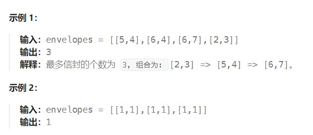
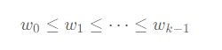
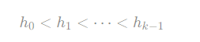

题目：

给你一个二维整数数组 `envelopes` ，其中 `envelopes[i] = [wi, hi]` ，表示第 `i` 个信封的宽度和高度。

当另一个信封的宽度和高度都比这个信封大的时候，这个信封就可以放进另一个信封里，如同俄罗斯套娃一样。

请计算 **最多能有多少个** 信封能组成一组“俄罗斯套娃”信封（即可以把一个信封放到另一个信封里面）。

**注意**：不允许旋转信封。



题解：

此题的思路与求**最大递增子序列**问题类似。

但是此题需要同时考虑 w 和 h 两个维度，同时控制 w 和 h 两个维度并不是那么容易，因此我们考虑**固定一个维度**，再**在另一个维度上进行选择**。

例如，我们固定 w 维度，那么我们将数组 envelopes 中的**所有信封按照 w 升序排序**。这样一来，我们**只要按照信封在数组中的出现顺序依次进行选取，就一定保证满足**：



在排序后，就可以**完全忽略** w 维度，只需要考虑 h 维度了。此时，我们需要解决的问题即为：

给定一个序列，我们需要找到一个最长的子序列，使得这个子序列中的元素严格单调递增，即上面要求的：



当 w  值相同时，如果我们规定 h 值按照升序顺序排序，那么可能会有如下的情况：

排完序的结果为 [(w,h)]=[(1,1),(1,2),(1,3),(1,4)] ，由于这些信封的 w 值都相同，不存在一个信封可以装下另一个信封，那么我们只能在其中选择 1 个信封。

然而如果我们完全忽略 w 维度，剩下的 h 维度为 [1,2,3,4] ，这是一个严格递增的序列，那么我们就可以选择所有的 4 个信封了，这就产生了错误。

因此，我们必须要保证**对于每一种 w 值，我们最多只能选择 1 个信封**。

我们可以将 **h 值**作为排序的第二关键字进行**降序排序**，这样一来，对于每一种 w 值，其对应的信封在排序后的数组中是按照 h 值递减的顺序出现的，那么这些 h 值不可能组成长度超过 1 的严格递增的序列，这就从根本上杜绝了错误的出现。

**认为h降序即可，略微有点问题。但是能通过**

```go
func maxEnvelopes(envelopes [][]int) int {
    // 1.按照 w 进行升序排序
    // 2.如果 w 相等，按照 h 降序排序(目的是实现相同 w 时选择具有最小 h 的信封)
    // 排序的目的是为了降低维度
    sort.Slice(envelopes, func(i, j int) bool {    
        a, b := envelopes[i], envelopes[j]
        return a[0] < b[0] || a[0] == b[0] && a[1] > b[1]
    })

    res := []int{}

    // w 是升序的，可以保证res中信封的 w 是升序的
    // h 是降序的，可以保证在 信封 w 升序的同时，获取到 h 递增速率最慢的递增序列。这样保证容纳尽可能多的信封。
    for i:=0; i<len(envelopes); i++ {   // 从头到尾遍历envelopes数组，因为已经排完序，因此按照wi升序
        env := envelopes[i]   // 该信封的宽度一定大于 res 中所有已有信封的宽度
        envH := env[1]   // 信封的高度

        if len(res) == 0 {
            res = append(res, envH)
        } else if res[len(res) - 1] < envH {   // 该信封的高度比res中所有的都大，直接追加到res中
            res = append(res, envH)
        } else if res[len(res) - 1] > envH {  // 可以尝试将该信封插入到 res 中合适的位置，替换掉第一个h >= envH 的信封
            left,right := 0, len(res) - 1
            mid := 0
            targetIndex := -1
            for left <= right {
                mid = left + (right - left) / 2
                if envH <= res[mid] {
                    right = mid - 1
                    targetIndex = mid   
                } else {
                    left = mid + 1
                }
            }
            if targetIndex != - 1 {
                res[targetIndex] = envH
            }
        }
    }
    return len(res)
}
```

