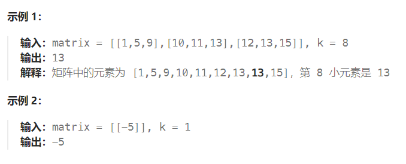
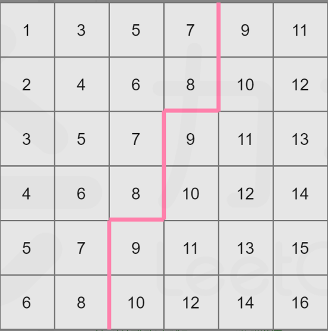
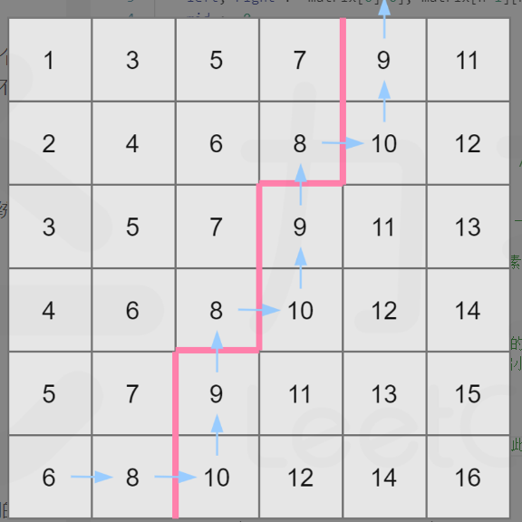

题目：

给你一个 `n x n` 矩阵 `matrix` ，其中每行和每列元素均按升序排序，找到矩阵中第 `k` 小的元素。
请注意，它是 **排序后** 的第 `k` 小元素，而不是第 `k` 个 **不同** 的元素。

你必须找到一个内存复杂度优于 `O(n2)` 的解决方案。




题解：

### 解法一：直接排序

最直接的做法是将这个二维数组转成一维数组，并对该一维数组进行排序。最后这个一维数组中的第 k 个数即为答案。

```go
func kthSmallest(matrix [][]int, k int) int {
    rows, columns := len(matrix), len(matrix[0])
    sorted := make([]int, rows * columns)
    index := 0
    for _, row := range matrix {
        for _, num := range row {
            sorted[index] = num
            index++
        }
    }
    sort.Ints(sorted)
    return sorted[k-1]
}
```

复杂度分析

- 时间复杂度：O(n^2*log⁡n) 对 n^2 个数排序。

- 空间复杂度：O(n^2)，一维数组需要存储这 n^2 个数。


### 解法二：二分查找

这个矩阵内的元素是从左上到右下递增的（假设矩阵左上角为 matrix[0] [0] ）。

我们知道整个二维数组中 matrix[0] [0] 为最小值，matrix[n−1] [n−1] 为最大值，现在我们将其分别记作 l 和 r 。

可以发现一个性质：任取一个数 mid 满足 l≤mid≤r ，那么矩阵中不大于 mid 的数，肯定全部分布在矩阵的左上角。

例如下图，取 mid=8 ：



我们可以看到，矩阵中大于 mid 的数就和不大于 mid 的数分别形成了两个板块。

沿着一条锯齿线将这个矩形分开。

其中左上角板块的大小即为矩阵中不大于 mid 的数的数量。

我们只要**沿着这条锯齿线走一**遍即可计算出这两个板块的大小，也自然就统计出了这个矩阵中不大于 mid 的数的个数了。

走法演示如下，依然取 mid=8 ：



可以这样描述走法：

- 初始位置在 matrix[n−1] [0] （即左下角）；
- 设当前位置为 matrix[i] [j] 。若 matrix[i] [j]≤mid ，则将当前所在列的不大于 mid 的数的数量（即 i+1 ）累加到答案中，并向右移动，否则向上移动；
- 不断移动直到走出格子为止。

我们发现这样的走法时间复杂度为 O(n) ，即我们可以线性计算对于任意一个 mid ，矩阵中有多少数不大于它。这满足了二分查找的性质。

不妨假设答案为 x ，那么可以知道 l≤x≤r ，这样就确定了二分查找的上下界。

每次对于「猜测」的答案 mid ，计算矩阵中有多少数不大于 mid ：

- 如果数量 >= k ，那么说明最终答案 x <= mid ；
- 如果数量 <  k ，那么说明最终答案 x  >  mid 。

这样我们就可以计算出最终的结果 x 了。

```go
func kthSmallest(matrix [][]int, k int) int {
    n := len(matrix)
    left, right := matrix[0][0], matrix[n-1][n-1]  // left,right 分别初始化为矩阵中的最小和最大值
    mid := 0

    for left <= right {
        mid = left + (right - left) / 2
        curr := check(matrix, mid)   // 求矩阵中 <= mid 的元素个数（但mid不一定存在于矩阵中）
        //  <= mid 的元素个数恰好 == k 个
        if curr == k {   
            if check(matrix, mid - 1) < k {  // <= mid - 1 的元素个数不到k个, 说明mid这个数一定在矩阵中存在
                return mid   
            }
            // <= mid - 1 的元素个数 == k 个，一方面说明 mid 不存在于矩阵中，一方面说明我们还需要到矩阵左侧继续找(因为mid-1也可能不存在)
            right = mid - 1 
        } else if curr > k {  // <= mid 的元素个数 > k 个，说明mid偏大
            if check(matrix, mid - 1) < k {     // <= mid - 1 的元素个数不足k个，说明mid一定存在于矩阵中 
                return mid
            }
            right = mid - 1   // <= mid - 1 的元素个数也 >= k 个，说明 mid-1 也偏大，继续到左区域查找
        } else if curr < k {   // 说明 mid 偏小，需要到右侧区域继续查询
            left = mid + 1
        }
    }
    return -1   // 走到这，说明是非法情况了，因此返回值任意
}

// 计算出矩阵中满足: <= mid 的元素数量
func check(matrix [][]int, mid int) int {
    n := len(matrix)
    i, j := n - 1, 0   // 从左下角开始
    num := 0
    for i >= 0 && j < n {   // 不越界
        if matrix[i][j] <= mid {   // 当前数 <= mid
            num += i + 1   // 因为从左下角开始移动，意味着当前matrix[i][j]所在的j列的前i+1个数都 <= mid
            j++   // 移动到下一列
        } else {
            i--     // 移动到上一行
        }
    }
    return num 
}
```

