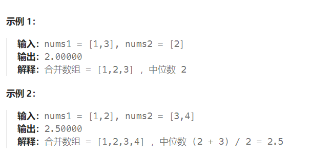
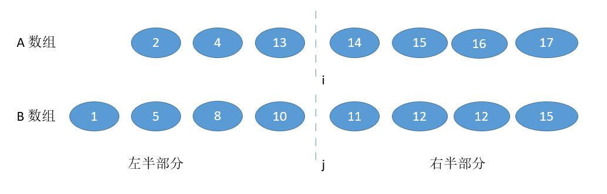

题目：

给定两个大小分别为 `m` 和 `n` 的正序（从小到大）数组 `nums1` 和 `nums2`。请你找出并返回这两个正序数组的 **中位数** 。

算法的时间复杂度应该为 `O(log (m+n))` 。



题解：

## 方法一：归并排序

时间复杂度是 O(m+n)

```go
func findMedianSortedArrays(nums1 []int, nums2 []int) float64 {
    totalLen := len(nums1) + len(nums2)   // 合并后应有的总长度
    if totalLen % 2 == 0 {   // 总长度为偶数，有两个中位数，需要求这两个数的平均值
        firstIndex := (1 + totalLen) / 2
        secondIndex := firstIndex + 1

        fisrtMid, secondMid := math.MinInt, math.MinInt

        num1Index, num2Index := 0,0
        k:=0
        for num1Index < len(nums1) && num2Index < len(nums2) {
            if nums1[num1Index] < nums2[num2Index] {
                k++
                if k == firstIndex {
                    fisrtMid = nums1[num1Index]
                } else if k == secondIndex {
                    secondMid = nums1[num1Index]
                } else {}
                num1Index++
            } else {
                k++
                if k == firstIndex {
                    fisrtMid = nums2[num2Index]
                } else if k == secondIndex {
                    secondMid = nums2[num2Index]
                } else {}
                num2Index++
            }
        }
        if fisrtMid != math.MinInt && secondMid != math.MinInt {
            return float64(fisrtMid + secondMid) / 2
        }

        for num1Index < len(nums1) {
            k++
            if k == firstIndex {
                fisrtMid = nums1[num1Index]
            } else if k == secondIndex {
                secondMid = nums1[num1Index]
            } else {}
            num1Index++ 
        }
        for num2Index < len(nums2) {
            k++
            if k == firstIndex {
                fisrtMid = nums2[num2Index]
            } else if k == secondIndex {
                secondMid = nums2[num2Index]
            } else {}
            num2Index++ 
        }
        return float64(fisrtMid + secondMid) / 2

    } else {   // 总长度为奇数，只有一个中位数
        midIndex := (1 + totalLen) / 2

        num1Index, num2Index := 0,0
        k:=0
        for num1Index < len(nums1) && num2Index < len(nums2) {
            if nums1[num1Index] < nums2[num2Index] {
                k++
                if k == midIndex {
                    return float64(nums1[num1Index])
                }
                num1Index++
            } else {
                k++
                if k == midIndex {
                    return float64(nums2[num2Index])
                }
                num2Index++
            }
        }

        for num1Index < len(nums1) {
            k++
            if k == midIndex {
                return float64(nums1[num1Index])
            }
            num1Index++ 
        }
        for num2Index < len(nums2) {
            k++
            if k == midIndex {
                return float64(nums2[num2Index])
            }
            num2Index++ 
        }
    }
    return -1
}
```

## 方法二：二分查找

时间复杂度是 O(log(m+n))

题目是求中位数，其实就是求第 `k` 小数的一种特殊情况，而**求第 `k` 小数有一种算法。**

上面的解法中，我们**一次遍历就相当于去掉不可能是中位数的一个值**，也就是**一个一个排除**。由于**数列是有序的，其实我们完全可以一半儿一半儿的排除**。假设我们要找第 k 小数，我们可以**每次循环排除掉 k/2 个数**。看下边一个例子。

假设我们要找第 7 小的数字。


我们**比较两个数组的第 k/2 个数字**，**如果 k 是奇数，向下取整（舍弃小数部分）**。也就是比较第 3 个数字，上边数组中的 4 和下边数组中的 3 ，**如果哪个小，就表明该数组的前 k/2 个数字都不是第 k 小数字，所以可以排除**。

也就是 1 ，2 ，3 这三个数字不可能是第 7 小的数字，我们可以把它排除掉。将 1349 和 45678910 两个数组作为**新的数组**进行比较。

更一般的情况 A[1] ，A[2] ，A[3]，……，A[k/2]  以及 B[1]，B[2]，B[3]，……，B[k/2] ，**如果 A[k/2]<B[k/2] ，那么A[1]，A[2]，A[3]，……，A[k/2]都不可能是第 k 小的数字。**

A 数组中比 A[k/2] 小的数有 k/2-1 个，B 数组中，B[k/2] 比 A[k/2] 大，假设 B[k/2] 前边的数字都比 A[k/2] 小，个数是 k/2-1个，所以**比 A[k/2] 小的数字最多有 k/1-1+k/2-1=k-2个**，所以 **A[k/2] 最多是第 k-1 小的数**。而**比 A[k/2] 小的数更不可能是第 k 小的数了**，所以可以把它们排除。

橙色的部分表示已经去掉的数字。


由于我们已经排除掉了 3 个数字，就是**这 3 个数字一定在最前边**，所以**在两个新数组中，我们只需要找第 7 - 3 = 4 小的数字就可以了，也就是 k = 4**。

此时两个数组，比较第 2 个数字，3 < 5，所以我们**可以把小的那个数组中的 1 ，3 排除掉了**。


我们**又排除掉 2 个数字，所以现在找第 4 - 2 = 2 小的数字就可以了**。

此时比较两个数组中的第 k / 2 = 1 个数，4 == 4，怎么办呢？**由于两个数相等，所以我们无论去掉哪个数组中的都行**，因为去掉 1 个总会保留 1 个的，所以没有影响。为了统一，我们就假设 4 > 4 吧，所以此时将下边的 4 去掉。


由于**又去掉 1 个数字，此时我们要找第 1 小的数字**，所以**只需判断两个数组中第一个数字哪个小就可以了**，也就是 4。

所以第 7 小的数字是 4。

#### 特殊情况：

我们每次都是取 `k/2` 的数进行比较，有时候**可能会遇到数组长度小于 `k/2`的时候。**


此时 k / 2 等于 3，而上边的数组长度是 2，我们此时**将箭头指向它的末尾就可以了**。这样的话，**由于 2 < 3，所以就会导致上边的数组 1，2 都被排除**。造成下边的情况。


由于 2 个元素被排除，所以此时 k = 5，又由于**上边的数组已经空了**，我们**只需要返回下边的数组的第 5 个数字就可以了**。

所以我们采用递归的思路：

- **为了防止数组长度小于 k/2，所以每次比较 min(k/2，len(数组) 对应的数字**。
- 每次把**小的那个对应的数组的数字排除**，将两个新数组进入递归。
- 并且 **k 要减去排除的数字的个数**。
- **递归出口**就是当 **k=1** 或者**其中一个数字长度是 0** 了。

```go
func findMedianSortedArrays(nums1 []int, nums2 []int) float64 {
    totalLen := len(nums1) + len(nums2)   // 合并后应有的总长度
    if totalLen % 2 == 1 {   // 长度为奇数，只需获取一个中位数
        mid := totalLen/2   // 中位数下标
        return float64(getKthElement(nums1, nums2, mid + 1))   // 第k+1小的数在合并数组中的下标是k（第1小的数下标该是0）
    } else {  // 长度为偶数，需要获取两个中位数，并且获取平均值
        mid1,mid2 := totalLen/2-1, totalLen/2
        return float64(getKthElement(nums1, nums2, mid1+1) + getKthElement(nums1, nums2, mid2+1)) / 2.0 
    }
    return 0
}
// 从 num1 和 num2 中获取第 k 小的元素
func getKthElement(nums1, nums2 []int, k int) int {
    index1, index2 := 0,0

    for {
        if index1 == len(nums1) {   // nums1已经全部遍历了，第k个小的数只能从nums2中获取
            return nums2[index2 + k - 1]   // 从index2开始数(包括index2)的第k个数
        }
        if index2 == len(nums2) {   // nums2已经全部遍历了，第k个小的数只能从nums1中获取
            return nums1[index1 + k - 1]   // 从index1开始数(包括index1)的第k个数
        }     
        if k == 1 {  // 从剩下的元素(index1……len(nums1) 和 index2……len(nums2) )中找到第1小的元素
            return getMin(nums1[index1], nums2[index2])
        }  
        half := k/2
        newIndex1 := getMin(index1 + half, len(nums1)) - 1  // nums1从index1开始的第 k/2 小的元素(不能越界访问)
        newIndex2 := getMin(index2 + half, len(nums2)) - 1  // nums2从index2开始的第 k/2 小的元素(不能越界访问)

        pivot1 := nums1[newIndex1]
        pivot2 := nums2[newIndex2]

        if pivot1 <= pivot2 {   // pivot1 前面最多有 k/2-1 + k/2-1 + 1 = k-1 个元素，因此不可能是第k个
            k -= (newIndex1 - index1 + 1)  // pivot1以及前面的 k/2-1 个元素必定位于合并数组的前面（前0~k-1，都不可能是第k个）
            index1 = newIndex1 + 1
        } else {   // pivot2 前面最多有 k-1 个元素，不可能是第k个
            k -= (newIndex2 - index2 + 1)
            index2 = newIndex2 + 1
        }
    }
    return 0
}
func getMin(a,b int) int {
    if a < b {
        return a
    } else {
        return b
    }
}
```

## 方法三：划分数组

一个长度为 m 的数组，有 0 到 m 总共 m + 1 个位置可以切。


我们把数组 A 和数组 B 分别在 i 和 j 进行切割。


将 i 的左边和 j 的左边组合成「左半部分」，将 i 的右边和 j 的右边组合成「右半部分」。

### 中位数在哪里？

1. 当 A 数组和 B 数组的**总长度是偶数**时，如果我们能够保证：
   1. 左半部分的长度等于右半部分，即：`i + j = m - i  + n - j`  , 也就是 `j = ( m + n ) / 2 - i`。
   2. 并且满足：左半部分最大的值小于等于右半部分最小的值 `max ( A [ i - 1 ] , B [ j - 1 ]）） <= min ( A [ i ] , B [ j ]））`
   3. 那么，中位数就可以表示如下: （左半部分最大值 + 右半部分最小值 ）/ 2。`（max ( A [ i - 1 ] , B [  j  - 1 ]）+ min ( A [ i ] , B [ j ]）） /  2`

2. 当 A 数组和 B 数组的总长度是奇数时，如果我们能够保证:
   1. 左半部分的长度比右半部分大 1，即：`  i + j = m - i  + n - j  + 1`也就是 ` j = ( m + n + 1) / 2 - i`
   2. 左半部分最大的值小于等于右半部分最小的值 max ( A [ i - 1 ] , B [ j - 1 ]）） <= min ( A [ i ] , B [ j ]））
   3. 那么，中位数就是: 左半部分最大值，也就是左半部比右半部分多出的那一个数。`max ( A [ i - 1 ] , B [  j - 1 ]）`

上边的条件我们其实**可以合并为 j=(m+n+1)/2−i** ，因为如果 m+n 是偶数，由于我们取的是 int  值，所以加 1 (1/2 = 0) 也不会影响结果。

其次，因为： 0<=i<=m  ，为了保证 0<=j<=n ，我们**必须保证 m<=n** 。

为了**保证 max ( A [ i - 1 ] , B [ j - 1 ]）） <= min ( A [ i ] , B [ j ]））**，因为 A 数组和 B 数组是有序的，所以 A [ i - 1 ] <= A [ i ]，B [ i - 1 ] <= B [ i ] 这是天然的，所以我们**只需要保证 B [ j - 1 ] < = A [ i ] 和 A [ i - 1 ] <= B [ j ]** 所以我们分两种情况讨论：

- 情况一：B [ j - 1 ] > A [ i ]，并且为了不越界，要保证 j > 0，i < m


此时很明显，我们**需要增加 i ，为了数量的平衡还要减少 j** ，幸运的是 j = ( m + n + 1) / 2 - i，i 增大，j 自然会减少。

- 情况二：**A [ i - 1 ] > B [ j ]** ，并且为了不越界，要保证 i > 0，j < n



此时和上边的情况相反，我们要减少 i ，增大 j 。

- 左边界情况：当 i = 0, 或者 j = 0，也就是切在了最前边。


此时左半部分当 **j = 0 时，最大的值就是 A [ i - 1 ]** ；当 **i = 0 时 最大的值就是 B [ j - 1]** 。右半部分最小值和之前一样。

- 右边界情况：当 i = m 或者 j = n，也就是切在了最后边。


此时左半部分最大值和之前一样。右半部分当 **j = n 时，最小值就是 A [ i ]** ；当 **i = m 时，最小值就是B [ j ]** 。


最后一个问题，**增加 i 的方式。当然用二分了**。**初始化 i 为中间的值，然后减半找中间的，减半找中间的，减半找中间的直到答案。**

```go
func findMedianSortedArrays(nums1 []int, nums2 []int) float64 {
    if len(nums1) > len(nums2) {   // 保证 len(nums1) <= len(nums2)  m<=n
        return findMedianSortedArrays(nums2, nums1)
    }
    m, n := len(nums1), len(nums2)
    left, right := 0, m    // i 的取值范围
    for left <= right {
        i := (left + right) / 2   // i 的取值采用二分法
        j := (m + n + 1) / 2 - i  // j 按照公式取值
        if j!=0 && i!= m && nums2[j-1] > nums1[i] {   // i 需要增大
            left = i + 1
        } else if i!=0 && j!=n && nums1[i-1] > nums2[j] {  // i需要减少
            right = i - 1
        } else {   // 达成要求，并且将边界条件列出来单独考虑
            maxLeft := 0 
            if (i == 0) {
                maxLeft = nums2[j-1]
            } else if (j == 0) {
                maxLeft = nums1[i-1]
            } else {
                maxLeft = max(nums1[i-1], nums2[j-1])
            }
            if (m+n) % 2 == 1 { // 奇数的话不需要考虑右半部分
                return float64(maxLeft) 
            }
            minRight := 0
            if i == m {
                minRight = nums2[j]
            } else if j == n {
                minRight = nums1[i]
            } else {
                minRight = min(nums1[i], nums2[j])
            }

            return float64(maxLeft + minRight) / 2.0 //如果是偶数的话返回结果
        }
    }
    return 0
}

func max(x, y int) int {
    if x > y {
        return x
    }
    return y
}

func min(x, y int) int {
    if x < y {
        return x
    }
    return y
}
```

