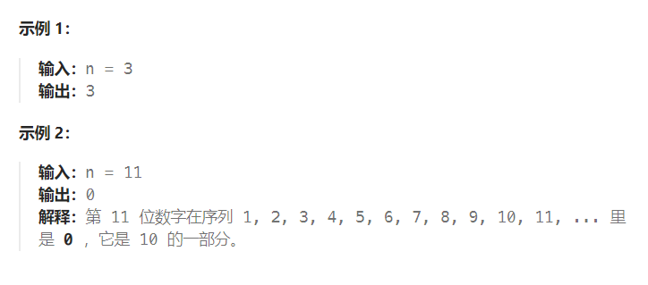

题目：

给你一个整数 `n` ，请你在无限的整数序列 `[1, 2, 3, 4, 5, 6, 7, 8, 9, 10, 11, ...]` 中找出并返回第 `n` 位上的数字。



题解：

脑筋急转弯 + 找规律，详细见官方题解：

```go
func findNthDigit(n int) int {
    // 位数 bitCount = 1 表示只有一位的数，也就是 1~9, 总共9个, 总共10位
    // 位数 bitCount = 2 表示只有两位的数，也就是 10~99, 总共90个，总共180位
    // 位数 bitCount = 3 表示只有三位的数，也就是 100~999, 总共900个, 总共2700位
    // 位数 bitCount = x 表示只有x位的数，也就是 10^(x-1) ~ 10^x -1, 总共 9*10^(x-1) 个, 总共 x*9*10^(x-1) 位

    // n的最大值是 2^31 -1,约为 2*10^9. 当x==9时， x*9*10^(x-1) = 8.1*10^9 > 2^31-1
    // 因此n位所在的整数最多是一个9位数，另x的上界为9即可。
    d := 1 + sort.Search(8, func(length int) bool {  // 找到超过n的最小位数上界d(刚好超过n的x取值)
        return totalDigits(length+1) >= n
    })
    prevDigits := totalDigits(d - 1)   // 获取位数 <= d-1 的数字的位数总和
    index := n - prevDigits - 1   // 第 n 位数在所有 d 位数的序列中的下标
    start := int(math.Pow10(d - 1))   // d 位数的起始值
    num := start + index/d    // 找到 n 位所在数字的前一个最接近的 d 位数
    digitIndex := index % d  // 在 num 后多出来的几位
    return num / int(math.Pow10(d-digitIndex-1)) % 10
}

func totalDigits(length int) (digits int) {
    for curLength, curCount := 1, 9; curLength <= length; curLength++ {
        digits += curLength * curCount
        curCount *= 10
    }
    return
}
```

