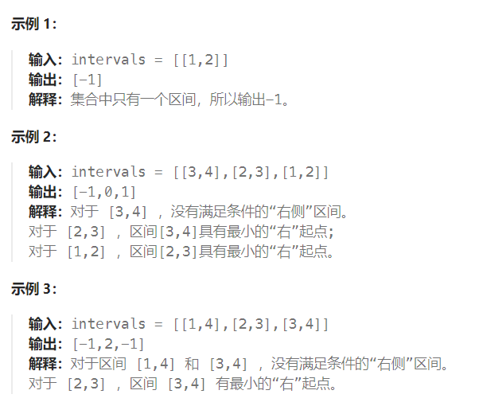

题目：

给你一个区间数组 `intervals` ，其中 `intervals[i] = [starti, endi]` ，且每个 `starti` 都 **不同** 。

区间 `i` 的 **右侧区间** 可以记作区间 `j` ，并满足 `startj >= endi` ，且 `startj` **最小化** 。注意 `i` 可能等于 `j` 。

返回一个由每个区间 `i` 的 **右侧区间** 在 `intervals` 中对应下标组成的数组。如果某个区间 `i` 不存在对应的 **右侧区间** ，则下标 `i` 处的值设为 `-1` 。



题解：

此题的一个关键条件是：**每个区间的 `starti` 都不同** 。

如果我们使用二分查找，基本的思路如下：

1. for循环 `intervals`数组，每次为当前区间`intervals[i]`寻找右侧区间
2. 必须将`intervals`数组按照`start`的大小进行升序排序，这样我们才能用二分查找寻找当前区间的右侧区间
3. 结果要求为当前区间记录下：右侧区间在原始`intervals`中的下标，我们就可以利用每个区间的`start`建立一个`start - index` 索引表（哈希表），根据区间的 start 值就可以获取该区间在原始`intervals`中的下标位置。

```go
func findRightInterval(intervals [][]int) []int {
    res := make([]int, len(intervals))

    startMap := make(map[int]int)  // 建立每个区间的: start - index 索引关系表（因为所有的start_i都不一样）
    for i:=0; i<len(intervals); i++ {
        start := intervals[i][0]
        startMap[start] = i
    }
    sort.Slice(intervals, func(i,j int) bool {   // intervals 按照 start 的大小进行升序排序
        if intervals[i][0] < intervals[j][0] {
            return true
        } else {
            return false
        }
    })
    // 每次为一个区间获取右侧区间
    for i:=0; i<len(intervals); i++ {
        start := intervals[i][0]   // 用于在 startMap 中获取索引
        target := intervals[i][1]   // 获取第 i 个区间的end

        // 采用二分法，在 intervals 中找到 start >= target 的第一个区间
        left, right := 0,len(intervals) - 1
        mid := 0
        mostLeft := -1   // 记录符合条件的第一个区间的下标(排序后的下标)
        for left <= right {
            mid = left + (right - left) / 2
            if target <= intervals[mid][0] {
                mostLeft = mid
                right = mid - 1
            } else {
                left = mid + 1
            }
        }
        if mostLeft == -1 {  // 没有找到符合条件的右区间
            res[startMap[start]] = -1
        } else {
            rightStart := intervals[mostLeft][0]  // 右区间的 start
            res[startMap[start]] = startMap[rightStart]
        }
    }
    return res
}
```

