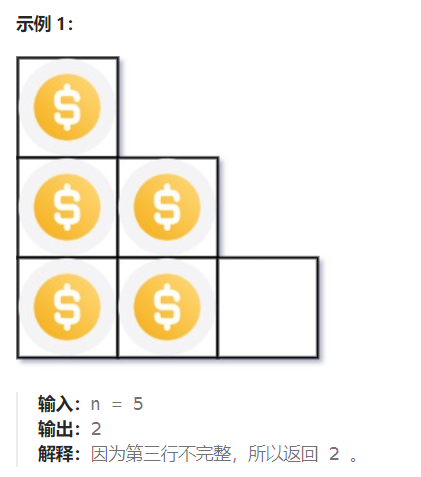

题目：

你总共有 `n` 枚硬币，并计划将它们按阶梯状排列。对于一个由 `k` 行组成的阶梯，其第 `i` 行必须正好有 `i` 枚硬币。阶梯的最后一行 **可能** 是不完整的。

给你一个数字 `n` ，计算并返回可形成 **完整阶梯行** 的总行数。



题解：

### 方法一：数学公式

```go
func arrangeCoins(n int) int {
    // 阶梯形状，所有k行都为完整行时所需的硬币数 == 1+2+3+……+k = k(k+1)/2
    k:= 0
    for {
        if k*(k+1)/2 > n {
            break
        }
        k++
    }

    return k-1

}
```

### 方法二：二分法

上述公式法，需要从 k 从 1 开始逐渐递增尝试，时间复杂度还是挺高的。使用二分法也是尝试不同的k，但是可以减少一半的尝试时间。

```go
func arrangeCoins(n int) int {
    // 阶梯形状，所需的硬币数 == 1+2+3+……+k = k(k+1)/2
    maxLine := int(math.Sqrt(float64(n*2))) // maxLine 肯定大于等于k(求和公式反向求k)
    // 二分法查询完整阶梯行数。最少一行(因为至少一个元素)，最多不超过maxLine行
    left,right := 1, maxLine   
    mid := 0
    res := 1   // 记录完整行号的数量
    for left <= right {
        mid = left + (right - left) / 2
        total := mid*(mid+1)/2    // 有 mid 行完整行时拥有的硬币数
        if total == n {
            return mid
        } else if  total < n {  // 行数不够，需要增加行数
            res = mid
            left = mid + 1
        } else if total > n {   // 行数太多，需要减小行数
            right = mid - 1
        }
    }
    return res
}
```

