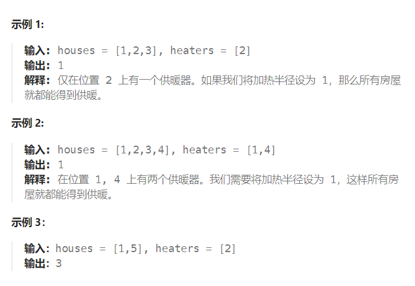

题目：

冬季已经来临。 你的任务是设计一个有固定加热半径的供暖器向所有房屋供暖。

在加热器的加热半径范围内的每个房屋都可以获得供暖。

现在，给出位于一条水平线上的房屋 `houses` 和供暖器 `heaters` 的位置，请你找出并返回可以覆盖所有房屋的最小加热半径。

**注意**：所有供暖器 `heaters` 都遵循你的半径标准，加热的半径也一样。



题解：

1. 将热水器升序排序
2. for循环处理每一个 `house`
3. 如果当前 `house` 在第一个供暖器的左侧，那么至少需要的热水器半径是：`heaters[0] - curHouse`
4. 如果当前 `house` 在最后一个供暖器的右侧，那么至少需要的热水器半径是：`curHouse - heaters[len(heaters) - 1]`
5. 如果当前 `house` 在最左和最右供暖器之间，那么需要在供暖器区间内找到距离当前房屋最近的一个供暖器

```go
func findRadius(houses []int, heaters []int) int {
    sort.Ints(heaters)
    minR := math.MinInt   // 记录热水器至少需要的半径
    for i:=0; i<len(houses); i++ {
        curHouse := houses[i]

        if curHouse < heaters[0] {   // 当前房屋在第一个热水器的左侧
            r := heaters[0] - curHouse 
            minR = getMax(minR, r)
        } else if curHouse > heaters[len(heaters) - 1] {  // 当前房屋在最后一个热水器的右侧
            r := curHouse - heaters[len(heaters) - 1]
            minR = getMax(minR, r)
        } else {   // 当前房屋在最左侧热水器和最右侧热水器之间，在热水器区间内找到距离当前房屋最近的一个热水器
            left, right := 0, len(heaters) - 1
            mid := 0
            mostLeft,mostRight := heaters[0], heaters[len(heaters) - 1]  // 分别记录距离房屋最近的左侧和右侧热水器的位置
            for left <= right {
                mid = left + (right - left) / 2
                curHeater := heaters[mid]
                if curHeater == curHouse {  // 热水器和房屋在同一个位置，左侧和右侧距离最近的都是当前位置，且不会有更近的
                    mostLeft = curHeater
                    mostRight = curHeater
                    break
                } else if curHeater < curHouse {  // 热水器在房屋的左侧
                    mostLeft = curHeater
                    left = mid + 1    // 继续向热水器的右侧查找
                } else if curHeater > curHouse {  // 热水器在房屋的右侧
                    mostRight = curHeater
                    right = mid - 1   // 继续向热水器的左侧查找
                }
            }
            r := getMin(curHouse - mostLeft, mostRight - curHouse)  // 选一个最近的热水器，计算至少需要的半径
            minR = getMax(minR, r)
        }
    }
    return minR
}
func getMax(a, b int) int {
    if a > b {
        return a 
    } else {
        return b
    }
}
func getMin(a, b int) int {
    if a < b {
        return a
    } else {
        return b
    }
}
```

