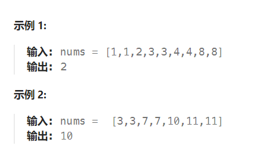

题目：

给你一个仅由整数组成的有序数组，其中每个元素都会出现两次，唯有一个数只会出现一次。

请你找出并返回只出现一次的那个数。

你设计的解决方案必须满足 `O(log n)` 时间复杂度和 `O(1)` 空间复杂度。



题解：

```go
func singleNonDuplicate(nums []int) int {
    left,right := 0, len(nums) - 1
    mid := 0
    // 偶奇 偶奇 …… 偶奇 偶 奇偶 奇偶 …… 奇偶
    // 1 1  2 2    3 3  4  5 5 6 6     7 7
    // 单一元素之前的: 相邻的两个相同元素的下标是: 偶奇; 
    // 单一元素之后的: 相邻的两个相同元素的下标是: 奇偶; 
    // 单一元素的下标是相同元素的开始下标的奇偶性的分界，因此可以使用二分查找的方法寻找单一元素
    
    for left <= right {
        mid = left + (right - left) / 2
        if mid % 2 == 0 {   // mid 是偶数
            // 相邻的两个相同元素下标是偶奇关系，说明当前mid在单一元素的左侧
            if mid + 1 < len(nums) && nums[mid] == nums[mid+1] {   
                left = mid + 1
            // 相邻的两个相同元素下标是奇偶关系，说明当前mid在单一元素的右侧
            } else if mid-1 >= 0 && nums[mid-1] == nums[mid] {
                right = mid - 1
            } else {   // 当前mid就是单一元素
                return nums[mid]
            }
        } else {   // mid 是奇数
            // 相邻的两个相同元素下标是偶奇关系，说明当前mid在单一元素的左侧
            if mid -1 >= 0 && nums[mid-1] == nums[mid] {   
                left = mid + 1
            // 相邻的两个相同元素下标是奇偶关系，说明当前mid在单一元素的右侧
            } else if mid+1 < len(nums) && nums[mid] == nums[mid+1] {
                right = mid - 1
            } else {   // 当前mid就是单一元素
                return nums[mid]
            }
        }
    }
    return -1
}
```

