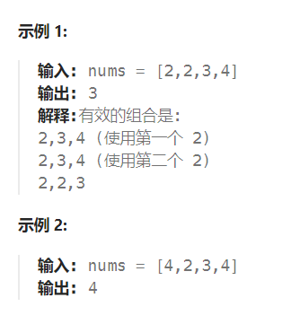
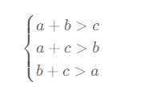

题目：

给定一个包含非负整数的数组 `nums` ，返回其中可以组成三角形三条边的三元组个数。



题解：

思路：**两次for循环分别固定第一条边和第二条边，通过二分法确定符合条件的第三条边的数目。**

1. 先对`nums`进行排序
2. 第二条边必须在第一条边之和，第三条边必须在第二条边之和

对于正整数 a,b,c ，它们可以作为三角形的三条边，当且仅当：



均成立。如果我们将**三条边进行升序排序**，使它们满足 a≤b≤c ，**那么 a+c>b 和 b+c>a 是一定成立的**，我们**只需要保证 a+b>c** 。

```go
func triangleNumber(nums []int) int {
    sort.Ints(nums)
    res := 0   // 记录符合条件的三元组个数

    for i:=0; i<len(nums); i++ {   // 选择第一条边
        for j:=i+1; j<len(nums); j++ {   // 选择第二条边
            target := nums[i] + nums[j]   // 两边之和必须大于第三条边

            left,right := j+1, len(nums) - 1
            mid := 0
            mostRight := -1   // 记录符合条件的最右侧第三条边的下标(最左侧固定就是 j+1 )
            for left <= right {
                mid = left + (right - left) /2
                if nums[mid] < target {   // 第三条边 小于 其他两边之和
                    mostRight = mid
                    left = mid + 1   // 尝试更长的第三条边，查看是否能够满足第三条要求
                } else {   // 选择的第三条边 >= 其余两边之和, 需要减小第三条边的长度
                    right = mid - 1
                }
            }
            if mostRight == -1 {   // 没有能够成为第三条边的
                continue
            } else {
                res += (mostRight - (j+1) +1)   // mostRight是最后一个满足三角形要求的边，j+1则是第一个满足三角形要求的边
            }
        }
    }
    return res
}
```

