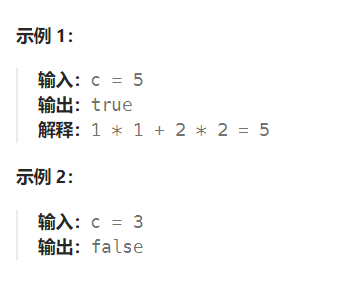

题目：

给定一个非负整数 `c` ，你要判断是否存在两个整数 `a` 和 `b`，使得 `a2 + b2 = c` 。



题解：

#### 方法一：直接使用 sqrt 函数

在枚举 a 的同时，使用 sqrt 函数找出 b 。

```go
func judgeSquareSum(c int) bool {
    for a := 0; a*a <= c; a++ {
        rt := math.Sqrt(float64(c - a*a))
        if rt == math.Floor(rt) {    // rt 是一个整数
            return true
        }
    }
    return false
}
```

如果要采用二分法找b，方法如下：

```go
func judgeSquareSum(c int) bool {
    // a 最小是 0, 此时b == sqrt(c)
    // a 最大是sqrt(c), 此时 b == 0
    // a 的取值范围是 0~sqrt(c)
    for a:=0; a <= int(math.Sqrt(float64(c))); a++ {
        target := c - a*a
        max, min := int(math.Sqrt(float64(target))) + 1, 0
        mid := 0
        for min <= max {
            mid = (max + min) / 2
            mul := mid * mid
            if mul == target {
                return true
            } else if mul < target {
                min = mid + 1
            } else if target < mul {
                max = mid - 1
            }
        }
    }
    return false
}
```

#### 方法二：双指针

```go
func judgeSquareSum(c int) bool {
    left, right := 0, int(math.Sqrt(float64(c)))
    for left <= right {
        sum := left*left + right*right
        if sum == c {
            return true
        } else if sum > c {
            right--
        } else {
            left++
        }
    }
    return false
}
```

