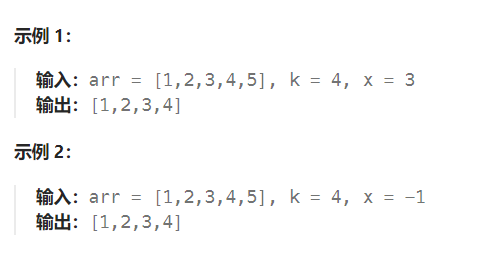

题目：

给定一个 **排序好** 的数组 `arr` ，两个整数 `k` 和 `x` ，从数组中找到最靠近 `x`（两数之差最小）的 `k` 个数。返回的结果必须要是按升序排好的。

整数 `a` 比整数 `b` 更接近 `x` 需要满足：

- `|a - x| < |b - x|` 或者
- `|a - x| == |b - x|` 且 `a < b`



题解：

**思路：二分查找+双指针**

- 先通过二分查找找到距离 x 最近的元素的两个下标(一左一右)
- 利用上述获得的两个下标作为双指针，分别向左和向右扩展，找到k个距离x最近的数字

```go
func findClosestElements(arr []int, k int, x int) []int { 
    if len(arr) == 1{
        return arr
    }
    left,right := 0, len(arr)-1
    mid := 0
    mostLeft, mostRight := -1,-1

    leftIndex, rightIndex := 0, 0   // 双指针，分别指向下一个将被移动到结果中的元素

    for left <= right {
        mid = left + (right - left) / 2
        if arr[mid] == x {
            mostLeft = mid
            mostRight = mid
            break
        } else if x < arr[mid] {
            right = mid - 1
            mostRight = mid
        } else if arr[mid] < x {
            left = mid + 1
            mostLeft = mid
        }
    }
    if mostLeft != -1 && mostLeft == mostRight {    
        if mostLeft == 0 {
            leftIndex = mostLeft
            rightIndex = mostLeft + 1
        } else if mostRight == len(arr) - 1{
            rightIndex = mostRight
            leftIndex = mostRight - 1
        } else {
            leftIndex = mostLeft
            rightIndex = mostLeft + 1
        }
    } else if mostLeft == -1 && mostRight != -1{   // 不存在比x小的数，全部都大于x
        return arr[:k]  // 直接返回前k个数
    } else if mostLeft != -1 && mostRight == -1 {   // 不存在比x大的数，全部都小于x
        return arr[len(arr)-k:]  // 直接返回后k个数
    } else if mostLeft != mostRight {
        leftIndex = mostLeft
        rightIndex = mostRight
    }

    // k<=0 的时候退出( k 的意义: 剩余需要插入到结果中的元素个数, 因此 k==1 是最后一个, k==0 时已经不在需要继续插入)
    for ;k > 0; k--{
        if leftIndex < 0 {
            rightIndex++
            continue
        }
        if rightIndex > len(arr) - 1 {
            leftIndex--
            continue
        }
        if getAbs(arr[leftIndex] - x) < getAbs(arr[rightIndex] - x)  {
            leftIndex--
        } else if getAbs(arr[leftIndex] - x) == getAbs(arr[rightIndex] - x) && leftIndex < rightIndex {
            leftIndex--
        } else { 
            rightIndex++       
        }
    }
    // leftIndex+1 是最后一个加入到结果中的最左侧下标( leftIndex 的意义是下一个将被将入到结果中的左侧下标)
    // rightIndex-1 是最后一个加入到结果中的最右侧下标( rightIndex 的意义是下一个将被将入到结果中的右侧下标)
    return arr[leftIndex+1:rightIndex]  
}
```

