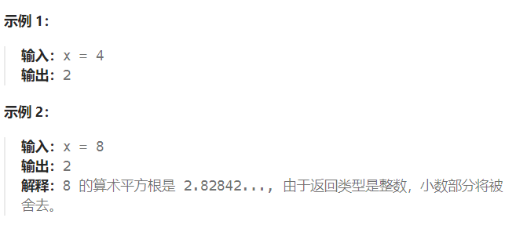

题目：

给你一个非负整数 `x` ，计算并返回 `x` 的 **算术平方根** 。

由于返回类型是整数，结果只保留 **整数部分** ，小数部分将被 **舍去 。**

**注意：**不允许使用任何内置指数函数和算符，例如 `pow(x, 0.5)` 或者 `x ** 0.5` 。



题解：

由于 x 平方根的整数部分 ans 是**满足 k*k ≤x 的最大 k 值**，因此我们可以对 k 进行二分查找，从而得到答案。

```go
func mySqrt(x int) int {
    if x == 0 || x == 1 {
        return x
    }
    start, end := 1, x-1
    mid := 0

    ans := 1
    for {
        if start > end {
            break
        }
        mid = start + (end - start) / 2
        product := mid * mid 
        if product <= x {   // mid * mid <= x  那么需要继续从右半区域中寻找mid
        // 因为采用的算术平方根,其最终结果是舍弃所有小数位,而不是四舍五入,因此是找到满足 mid*mid <= x 的最右侧一个mid
            ans = mid    
            start = mid + 1
        } else if product > x {   // mid * mid > x  那么需要继续从左半区域中需要mid
            end = mid - 1
        }
    }
    return ans
}
```

