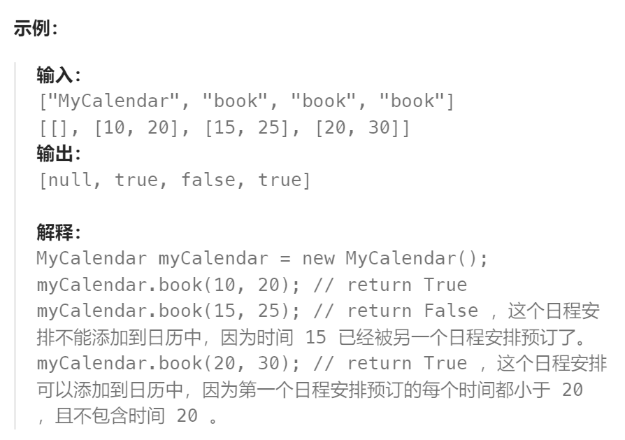

题目：

实现一个 `MyCalendar` 类来存放你的日程安排。如果要添加的日程安排不会造成 **重复预订** ，则可以存储这个新的日程安排。

当两个日程安排有一些时间上的交叉时（例如两个日程安排都在同一时间内），就会产生 **重复预订** 。

日程可以用一对整数 `start` 和 `end` 表示，这里的时间是半开区间，即 `[start, end)`, 实数 `x` 的范围为，  `start <= x < end` 。

实现 `MyCalendar` 类：

- `MyCalendar()` 初始化日历对象。
- `boolean book(int start, int end)` 如果可以将日程安排成功添加到日历中而不会导致重复预订，返回 `true` 。否则，返回 `false` 并且不要将该日程安排添加到日历中。



题解：

```go
type MyCalendar struct {
    startSet []int
    endSet []int
}
func Constructor() MyCalendar {
    mc := &MyCalendar{}
    mc.startSet = make([]int, 0)
    mc.endSet = make([]int, 0)

    return *mc
}
func (this *MyCalendar) Book(start int, end int) bool {
    if len(this.startSet) == 0 {
        this.startSet = append(this.startSet, start)
        this.endSet = append(this.endSet, end)
        return true
    }
    // 检查 start 是否曾经出现 
    // 1. 如果出现过，则为重复，返回 false (因为区间都是左闭右开，左边重合就是重复预定)
    // 2. 如果没出现过, 则将这个新的区域的 start和 end 插入到正确的位置
    sLeft, sRight := 0, len(this.startSet) - 1
    sMid := 0
    for sLeft <= sRight {
        sMid = sLeft + (sRight - sLeft) / 2
        if start == this.startSet[sMid] {
            return false
        } else if start < this.startSet[sMid] {
            if end <= this.startSet[sMid] {  // 整个区域都在 sMid 区域的左侧（end可以等于）
                sRight = sMid - 1  // 继续到左侧查找
            } else {   // 该区域与 sMid 区域存在重合
                return false
            }
        } else if start > this.startSet[sMid] {
            if start >= this.endSet[sMid] {   // 整个区域都在 sMid 的右侧（可以等于end）
                sLeft = sMid + 1	// 继续到右侧查找
            } else {  // 该区域与 sMid 区域存在重合
                return false
            }
        }
    }
    if sRight == -1 {   // 在之前所有区域的前方（sRight）
        this.startSet = append([]int{start}, this.startSet...)
        this.endSet = append([]int{end}, this.endSet...)
    } else if sLeft == len(this.startSet)  {   // 在之前所有区域的后方（sLeft）
        this.startSet = append(this.startSet, start)
        this.endSet = append(this.endSet, end)
    } else {   // 在中间（作为新的sLeft）
        this.startSet = append(this.startSet[:sLeft], append([]int{start}, this.startSet[sLeft:]...)...)
        this.endSet = append(this.endSet[:sLeft], append([]int{end}, this.endSet[sLeft:]...)...)
    }
    return true
}
```


