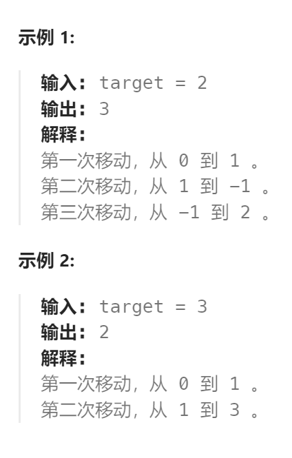

题目：

在一根无限长的数轴上，你站在`0`的位置。终点在`target`的位置。

你可以做一些数量的移动 `numMoves` :

- 每次你可以选择向左或向右移动。
- 第 `i` 次移动（从  `i == 1` 开始，到 `i == numMoves` ），在选择的方向上走 `i` 步。

给定整数 `target` ，返回 *到达目标所需的 **最小** 移动次数(即最小 `numMoves` )* 。



题解：

1. 如果还没到达`target`，那必然是要移动的，无论向左还是向右，步数都要+1。
2. 如果当前到达或超过`target`，则需要根据当前位置距离`target`的距离作进一步判断：
   1. 假如走到第k步，差值为偶数，那就**一定可以通过调整之前的步数来使差值为0**。假如target为4，那第三步的s为6，差值为2，那就可以调整第1步往后走，第2，3步往前走，总步数还是3。**调整步数只改变方向，不改变移动次数。** 
   2. 假如**差值是奇数，那就只能继续往前加至差数为偶数了**，所以移动次数得+1。

```go
func reachNumber(target int) (n int) {
    if target < 0 {   // 终点在左侧还是右侧不影响实际走的步数
        target = -target
    }
    s := 0   // 当前位置
    for s < target || (s-target)%2 == 1 { // 没有到达（越过）终点，或者相距奇数
        n++
        s += n  // 第n次向右移动，需要向右走n步
    }
    return
}
```

