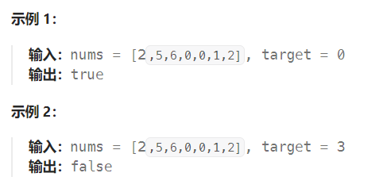

题目：

已知存在一个按非降序排列的整数数组 `nums` ，数组中的值不必互不相同。

在传递给函数之前，`nums` 在预先未知的某个下标 `k`（`0 <= k < nums.length`）上进行了 **旋转** ，使数组变为 `[nums[k], nums[k+1], ..., nums[n-1], nums[0], nums[1], ..., nums[k-1]]`（下标 **从 0 开始** 计数）。例如， `[0,1,2,4,4,4,5,6,6,7]` 在下标 `5` 处经旋转后可能变为 `[4,5,6,6,7,0,1,2,4,4]` 。

给你 **旋转后** 的数组 `nums` 和一个整数 `target` ，请你编写一个函数来判断给定的目标值是否存在于数组中。如果 `nums` 中存在这个目标值 `target` ，则返回 `true` ，否则返回 `false` 。

你必须尽可能减少整个操作步骤。



题解：

本篇题解基于[33. 搜索旋转排序数组的题解]

但在`33`题之上有所改进，即：**数组中元素可以重复**

对于数组中有重复元素的情况，二分查找时可能会有 `a[l]=a[mid]=a[r]` ，此时无法判断区间` [l,mid]` 和区间 `[mid+1,r]` 哪个是有序的。

例如 `nums=[3,1,3,3,3,3,3]` ，target=2，首次二分时**无法判断区间 [0,3] 和区间 [4,6] 哪个是有序的。**

对于这种情况，我们只能将**当前二分区间的左边界加一，右边界减一**，然后在新区间上继续二分查找。

```go
func search(nums []int, target int) bool {
    left, right := 0, len(nums) - 1
    mid := 0

    for left <= right {
        mid = left + (right - left) / 2
        if nums[mid] == target {
            return true
        } else if nums[left] == nums[mid] && nums[mid] == nums[right] {  // 左右区域必有一个有序，但此情况无法区分
            left++
            right--
        } else if left <= mid - 1 && nums[left] <= nums[mid - 1] {   // 左半区域是有序的
            if nums[left] <= target && target <= nums[mid - 1] {   // 数字位于左半区域
                right = mid - 1
            } else {
                left = mid + 1
            }
        } else {   // 左半区域不是有序的, 那么右半区域必然是有序的
            if mid + 1 <= right && nums[mid + 1] <= target && target <= nums[right] {   // 数字位于右半区域
                left = mid + 1
            } else {
                right = mid - 1
            }
        }
    }
    return false
}
```

