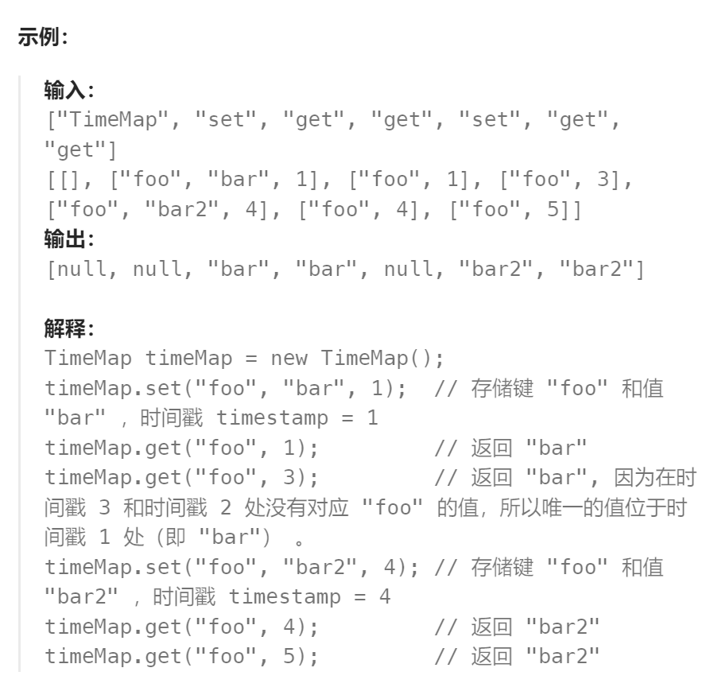

题目：

设计一个基于时间的键值数据结构，该结构可以在不同时间戳存储对应同一个键的多个值，并针对特定时间戳检索键对应的值。

实现 `TimeMap` 类：

- `TimeMap()` 初始化数据结构对象

- `void set(String key, String value, int timestamp)` 存储键 `key`、值 `value`，以及给定的时间戳 `timestamp`。

- ```
  String get(String key, int timestamp)
  ```

  - 返回先前调用 `set(key, value, timestamp_prev)` 所存储的值，其中 `timestamp_prev <= timestamp` 。
  - 如果有多个这样的值，则返回对应最大的 `timestamp_prev` 的那个值。
  - 如果没有值，则返回空字符串（`""`）。



题解：

```go
type TimeMap struct {
    kv map[string][]valTime   // value 基于 timestamp从小到大排序
}

type valTime struct {
    val string
    timeStamp int
}


func Constructor() TimeMap {
    kv := make(map[string][]valTime)
    tm := &TimeMap{kv}
    return *tm
}

// 插入k-v时保证 v 按照时间戳从小到大有序
func (this *TimeMap) Set(key string, value string, timestamp int)  {
    vSet,ok := this.kv[key]
    if !ok {   // 该 k-v 是新出现的
        vt := valTime{val: value, timeStamp: timestamp} 
        this.kv[key] = append(this.kv[key], vt)
        return
    }
    // 该 k-v 不是新出现的，需要将其插入到合适的位置（按照timeStamp进行排序）
    left, right := 0, len(vSet)-1
    mid := 0
    for left <= right {
        mid = left + (right - left) / 2
        if timestamp == vSet[mid].timeStamp {   // 时间戳相等，则只更新value
            this.kv[key][mid].val = value
        } else if timestamp < vSet[mid].timeStamp {
            right = mid - 1
        } else {
            left = mid + 1
        }
    }
    newVT := valTime{value, timestamp}
    if right == -1 {   // 比所有 timeStamp 都小
        this.kv[key] = append([]valTime{newVT}, this.kv[key]...)
    } else if left == len(vSet) {   // 比所有 timeStamp 都大
        this.kv[key] = append(this.kv[key], newVT)
    } else {   // 位于中间的 timeStamp
		this.kv[key] = append(this.kv[key][:left], append([]valTime{newVT}, this.kv[key][left:]...)...)
    }
    return
}

// 二分法查找有序 val 数组
func (this *TimeMap) Get(key string, timestamp int) string {
    vSet,ok := this.kv[key]        
    if !ok {  // 对应 key-value 并不存在过
        return ""
    }
    // 找到 <= timeStamp 的最大 val
    left, right := 0, len(vSet) - 1
    mid := 0
    mostRight := -1
    for left <= right {
        mid = left + (right - left) / 2
        prev_vt := vSet[mid]
        if timestamp == prev_vt.timeStamp {
            return prev_vt.val
        } else if timestamp < prev_vt.timeStamp {
            right = mid - 1
        } else {
            mostRight = mid
            left = mid + 1
        }
    }
    if mostRight == -1  {  // 说明 timeStamp 比之前的时间戳都要小
        return ""
    } else {
        return vSet[mostRight].val
    }
}
```

