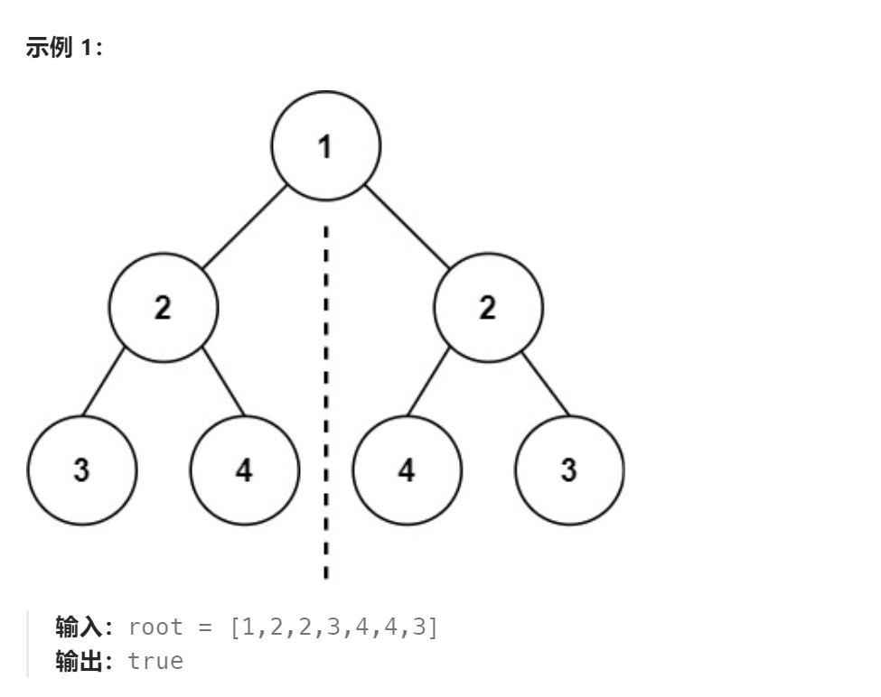
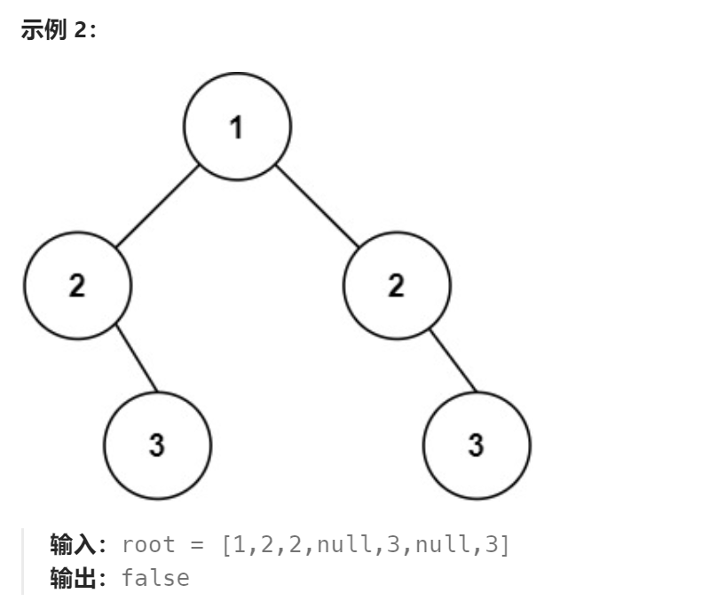

题目：

给你一个二叉树的根节点 `root` ， 检查它是否轴对称。





题解：

```go
/**
 * Definition for a binary tree node.
 * type TreeNode struct {
 *     Val int
 *     Left *TreeNode
 *     Right *TreeNode
 * }
 */
func isSymmetric(root *TreeNode) bool {
    if root == nil {
        return true
    }
    return check(root.Left,root.Right)
}

func check(p,q *TreeNode) bool {
    if p == nil && q== nil {
        return true
    }
    if p == nil && q!=nil {
        return false
    } 
    if p!=nil && q==nil {
        return false
    }

    if !check(p.Left,q.Right) {  // 判断是否 树1的左子树 == 树2的右子树
        return false
    }
    if !check(p.Right,q.Left) {  // 判断是否 树1的右子树 == 树2的左子树
        return false
    }
    if p.Val != q.Val {
        return false
    }
    return true
}
```


```java
class Solution {
    public boolean compare(TreeNode left, TreeNode right) {
        if (left == null && right ==null) {
            return true;
        } else if (left != null && right ==null) {
            return false;
        } else if (left == null && right != null) {
            return false;
        } else if (left.val != right.val) {
            return false;
        } else {

            boolean outside = compare(left.left, right.right);   // 比较外侧
            boolean inside = compare(left.right, right.left);  // 比较内侧

            return outside && inside;
        }
    }
    public boolean isSymmetric(TreeNode root) {
        if (root == null) {
            return true;
        }
        return compare(root.left, root.right);
    }
}
```

