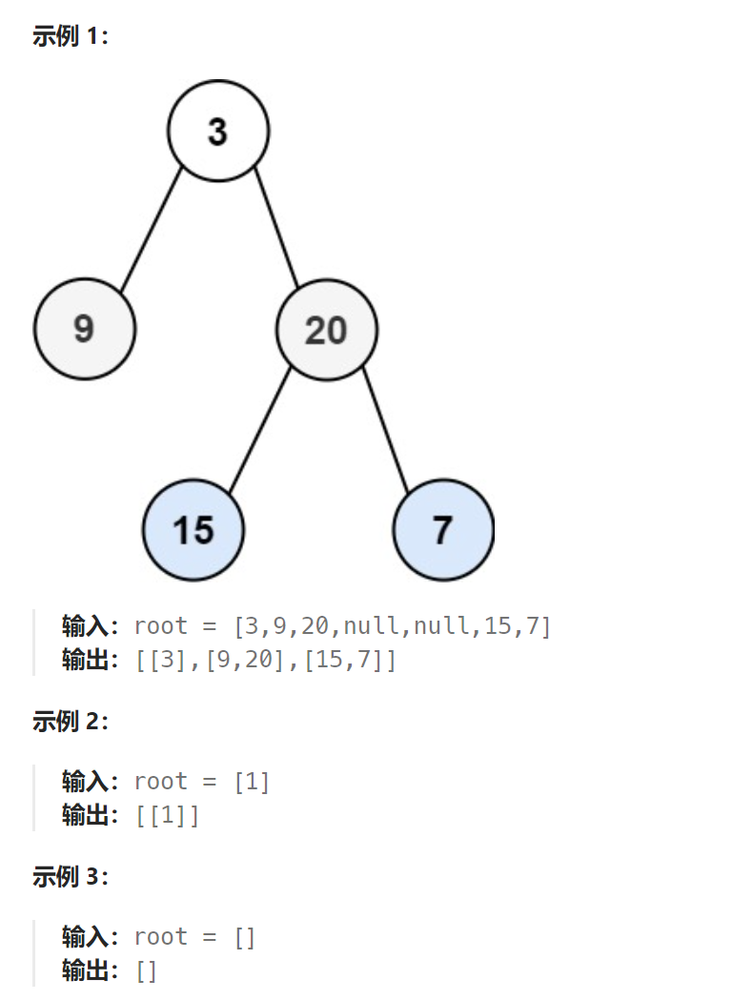

题目:

给你二叉树的根节点 `root` ，返回其节点值的 **层序遍历** 。 （即逐层地，从左到右访问所有节点）。



题解：

最朴素的方法是用一个**二元组 (node, level) 来表示状态**，它**表示某个节点和它所在的层数**，每个**新进队列的节点的 level 值都是父亲节点的 level 值加一**。最后根据每个点的 level 对点进行分类，分类的时候我们可以利用哈希表，维护一个以 level 为键，对应节点值组成的数组为值，广度优先搜索结束以后按键 level 从小到大取出所有值，组成答案返回即可。

考虑如何优化空间开销：**如何不用哈希映射，并且只用一个变量 node 表示状态，实现这个功能呢？**

```golang
// 与传统层序遍历每次从队列中取出一个节点的操作不同。下述的方法相当于每次从队列中取出位于同一层的所有节点
func levelOrder(root *TreeNode) [][]int {
    ret := [][]int{}
    if root == nil {
        return ret
    }
    q := []*TreeNode{root}    // q用来保存当前层的二叉树节点
    
    layer := 0   // 记录当前层数
    
    for len(q) > 0{    // 此循环当且仅当当前层没有任何节点时才会结束(相当于队列为空)
        ret = append(ret, []int{})   // ret 追加一个保存当前层节点(下面会从q中取出)的int切片
        p := []*TreeNode{}		// p用来保存下一层的二叉树节点
        for j := 0; j < len(q); j++ {    // 会一次性把当前层的所有节点遍历到(取出)
            node := q[j]
            ret[layer] = append(ret[layer], node.Val) //从q中取出当前层的二叉树节点,将其存到当前层的ret中
            if node.Left != nil {
                p = append(p, node.Left)  // 当前节点的左孩子节点一定在下一层，因此存入p
            }
            if node.Right != nil {
                p = append(p, node.Right)	// 当前节点的右孩子节点一定在下一层，因此存入p
            }
        }
        q = p    // 下一层变成新的当前层（统计下一层）
        layer++
    }
    return ret
}
```

```java
class Solution {
    public List<List<Integer>> levelOrder(TreeNode root) {
        List<List<Integer>> res = new ArrayList<>();

        if (root == null) {
            return res;
        }

        Queue<TreeNode> curLine = new LinkedList<>();
        curLine.add(root);

        while (!curLine.isEmpty()) {
            Queue<TreeNode> nextLine = new LinkedList<>();
            List<Integer> vals = new ArrayList<>();
            int size = curLine.size();    // curLine 的大小必须事先拿出来，不能作为循环条件，因为会随时变化
            for (int i = 0; i < size; i++) {  // 不能是 i < curLine.size()
                TreeNode node = curLine.poll();
                vals.add(node.val);

                if (node.left != null) {
                    nextLine.add(node.left);
                }
                if (node.right != null) {
                    nextLine.add(node.right);
                }
            }
            res.add(vals);
            curLine = nextLine;

        }
        return res;
    }
}
```

