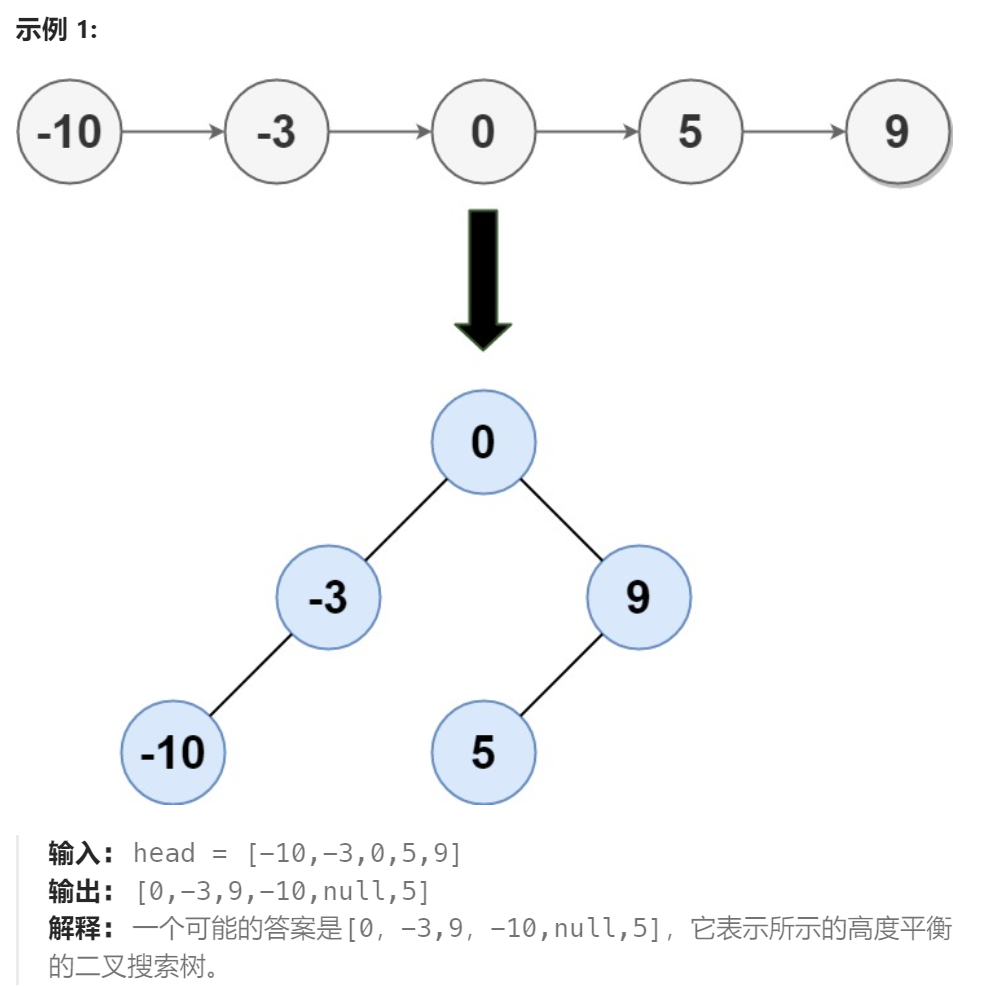

题目：

给定一个单链表的头节点  `head` ，其中的元素 **按升序排序** ，将其转换为高度平衡的二叉搜索树。

本题中，一个高度平衡二叉树是指一个二叉树*每个节点* 的左右两个子树的高度差不超过 1。



题解：

注意：

- `func getLLmid(head,tail *ListNode) *ListNode`的迭代结束条件
- `func createAVL(head, mid ,tail *ListNode) *TreeNode`的递归结束条件

```go
/**
 * Definition for singly-linked list.
 * type ListNode struct {
 *     Val int
 *     Next *ListNode
 * }
 */
/**
 * Definition for a binary tree node.
 * type TreeNode struct {
 *     Val int
 *     Left *TreeNode
 *     Right *TreeNode
 * }
 */
func sortedListToBST(head *ListNode) *TreeNode {
    if head == nil {
        return nil
    }

    mid := getLLmid(head,nil)  // 获得链表头中点

    return createAVL(head,mid,nil)
}

func createAVL(head, mid ,tail *ListNode) *TreeNode {
    if head == tail {  // 因为tail是不属于当前链表的,head == tail 表示当前为空链表
        return nil
    }

    root := &TreeNode{mid.Val,nil,nil}   // 中点作为当前子树的根节点

    leftMid := getLLmid(head,mid)  // 获得左链表中点 [head,mid)
    rightMid := getLLmid(mid.Next,tail)  // 获取右链表中点 [mid + 1,tail)

    root.Left = createAVL(head,leftMid,mid)
    root.Right = createAVL(mid.Next,rightMid,tail)

    return root
}


// 传入链表的头和尾节点的Next(即tail不属于当前链表)。返回该链表的中间节点的指针
func getLLmid(head,tail *ListNode) *ListNode{
    slow := head  // 最终获得链表中点节点的地址
    fast := head   // 最终获得链表终点节点的地址
    for {
        if fast == tail || fast.Next == tail {  // 分别针对链表长度为 1.偶数 2.奇数 的情况
            break
        }
        slow = slow.Next
        fast = fast.Next.Next
    }
    return slow
}
```

