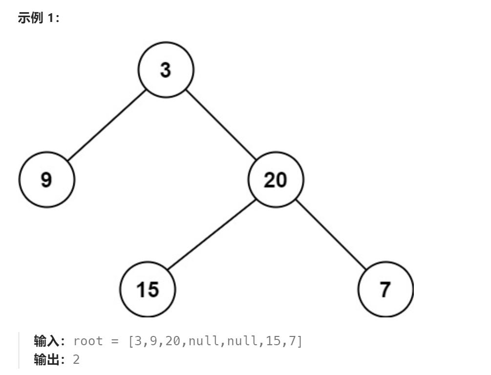

题目：

给定一个二叉树，找出其最小深度。

最小深度是从根节点到最近叶子节点的最短路径上的节点数量。

**说明：**叶子节点是指没有子节点的节点。



题解：

这个题要注意：要求的是**通向叶子节点的最小深度**

因此下面的代码是错误的：

错误的原因是：

```go
下述代码将在 1.通向叶子结点的路径  2.通向nil节点(也就是不存在的节点)的路径 这两种路径中寻找最小深度
比如：一个二叉树，根节点的左孩子不存在，那么下述代码会直接返回最小深度为:1
也就是通向左侧nil的路径
```

```go
/**
 * Definition for a binary tree node.
 * type TreeNode struct {
 *     Val int
 *     Left *TreeNode
 *     Right *TreeNode
 * }
 */
func minDepth(root *TreeNode) int {
    if root == nil {  
        return 0
    }
   
    leftH := minDepth(root.Left)
    rightH := minDepth(root.Right)

    return getMin(leftH,rightH) + 1
}

func getMin(a,b int) int {
    if a < b {
        return a
    } else {
        return b
    }
}
```

正确的代码如下：

```
提前将通向nil的路径分支阻挡住，不参与最优路径选择比较中
```

```go
func minDepth(root *TreeNode) int {
    if root == nil {   // 空节点不参与最小深度计算，因此设置为0(一个异常值),使得到达这里的分支不被选择
        return 0
    }
    if root.Left == nil && root.Right == nil {   // 叶子节点
        return 1
    }

    leftH := minDepth(root.Left)
    rightH := minDepth(root.Right)

    // 到达这里的节点，不可能leftH和rightH同时为0
    if leftH == 0 {
        return rightH + 1
    } else if rightH == 0 {
        return leftH + 1
    } else {
        return getMin(leftH,rightH) + 1
    }
}

func getMin(a,b int) int {
    if a < b {
        return a
    } else {
        return b
    }
}
```

