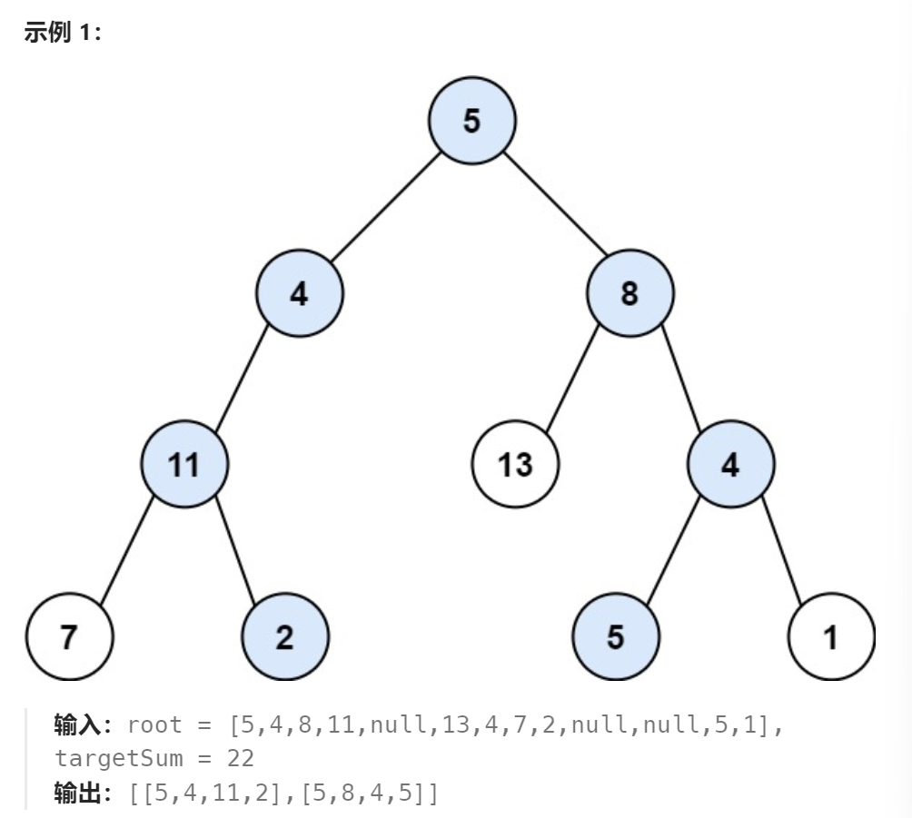

题目：

给你二叉树的根节点 `root` 和一个整数目标和 `targetSum` ，找出所有 **从根节点到叶子节点** 路径总和等于给定目标和的路径。

**叶子节点** 是指没有子节点的节点。



解法：

此题不难，只不过需要注意一个使用切片slice时可能出现的bug

```go
func pathSum(root *TreeNode, targetSum int) [][]int {
    allPath := make([][]int,0)  // 所有路线共用同一个
    curPath := make([]int,0)
    helper(root,targetSum,&allPath,curPath)

    return allPath
}

func helper(root *TreeNode,targetSum int,allPath *[][]int,curPath []int) {
    if root == nil {
        return 
    }
    if root.Left == nil && root.Right == nil {
        if targetSum == root.Val {
            tempCurPath := make([]int,0)
            tempCurPath = append(tempCurPath,curPath...)
            tempCurPath = append(tempCurPath,root.Val)
            // 下面这种方式会修改切片curPath的原有结构，对与另一个共享curPath的分支会有影响
    		// tempCurPath := []int{root.Val} 
    		// tempCurPath = append(curPath,tempCurPath...) 
            *allPath = append(*allPath,tempCurPath)
        } 
        return
    }

    newCurPath := make([]int,0) // 当前根节点需要新建一个切片存储路径上节点的值
    newCurPath = append(newCurPath,curPath...)  // 首先要继承上面已有的路径
    newCurPath = append(newCurPath,root.Val) // 其次要加上当前节点自己的值

    // 下面这种方式会修改切片curPath的原有结构，对与另一个共享curPath的分支会有影响
    // newCurPath := []int{root.Val} 
    // newCurPath = append(curPath,newCurPath...)  

    helper(root.Left, targetSum - root.Val, allPath, newCurPath)
    helper(root.Right, targetSum - root.Val, allPath, newCurPath)
    
    return    
}
```

