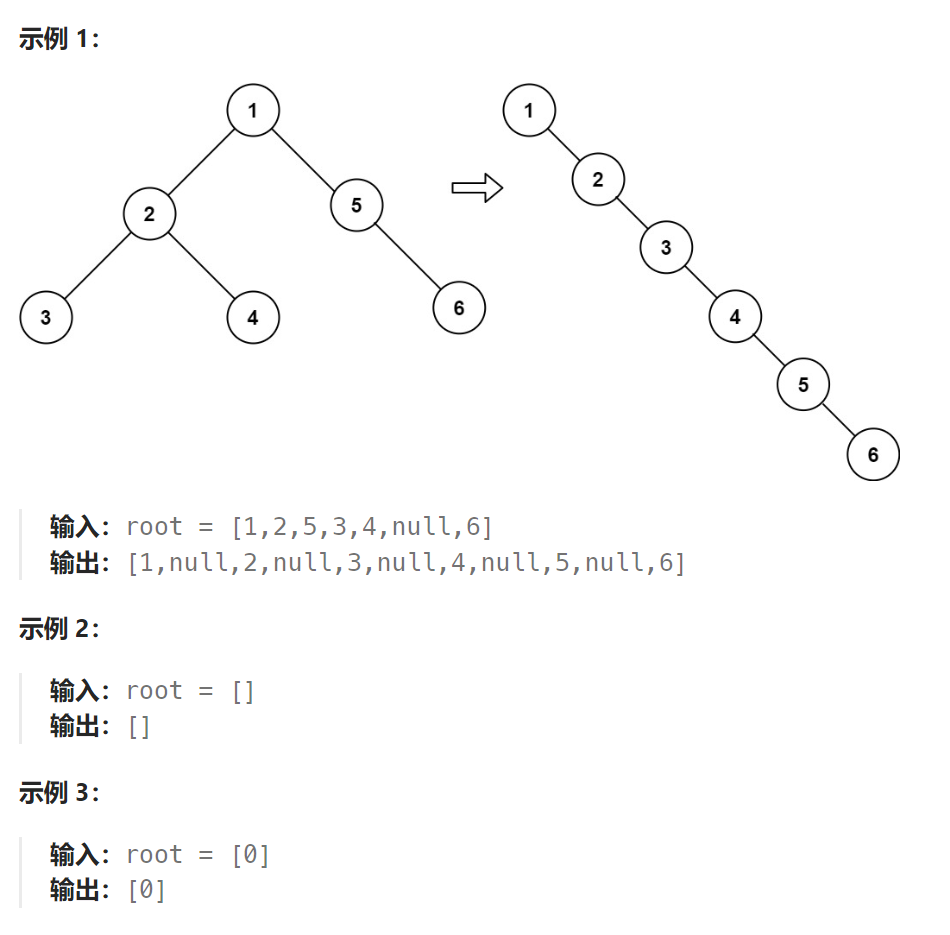

题目：

给你二叉树的根结点 `root` ，请你将它展开为一个单链表：

- 展开后的单链表应该同样使用 `TreeNode` ，其中 `right` 子指针指向链表中下一个结点，而左子指针始终为 `null` 。

- 展开后的单链表应该与二叉树 [**先序遍历**](https://baike.baidu.com/item/先序遍历/6442839?fr=aladdin) 顺序相同。



解答：

```go
思路很简答,就是采用递归的策略：先把左子树变成链表，再把右子树变成链表，最后将当前子树整体变成链表。因此在遍历二叉树时是后序遍历。
通过将左子树移动到右子树位置，再将原来的右子树接到左子树的后面就可以实现链表的先序遍历。

此题的难点在于：对递归函数返回值的确定，尤其是链表尾节点的返回
```


```go
func flatten(root *TreeNode)  {
    if root == nil  {
        return 
    }
    helper(root)
}

// 分别返回转换后的链表的头和为节点
func helper(root *TreeNode) (*TreeNode,*TreeNode) {
    if root == nil {
        return nil,nil
    }

    leftH,leftT := helper(root.Left)  // 先把左子树处理为单链表
    rightH,rightT := helper(root.Right)  // 再把右子树处理为单链表

    // 最后把当前子树处理为单链表
    if leftH == nil && rightH == nil {
        return root,root
    }
    if leftH != nil {
        leftT.Right = rightH
        root.Right = leftH
        root.Left = nil
    }

    // 这里要考虑当前链表尾部的选择(链表头结点总是当前root)
    if leftT == nil && rightT == nil {  // 1.都为nil,此时选择root作尾节点
        return root,root
    } else if leftT == nil {   // 只有left为空链表,此时选择rightT
        return root,rightT
    } else if rightT == nil {  // 只有right为空链表,此时选择leftT
        return root,leftT
    } else {   // 都不为空,选择rightT
        return root,rightT
    }

}
```

