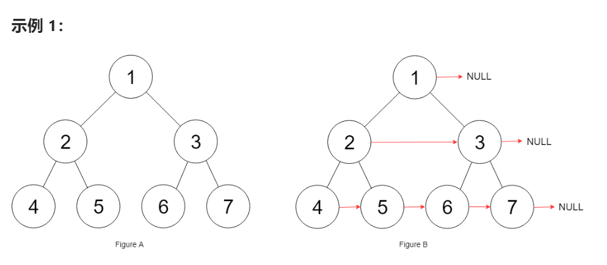
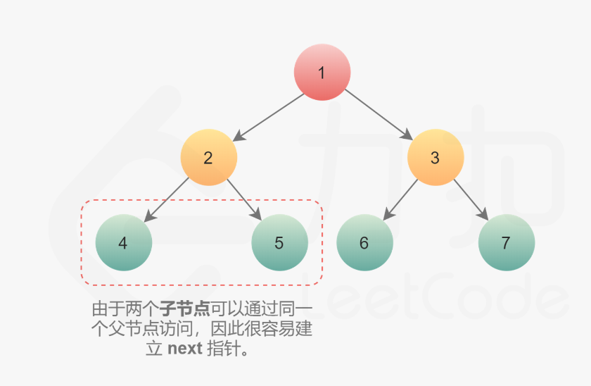
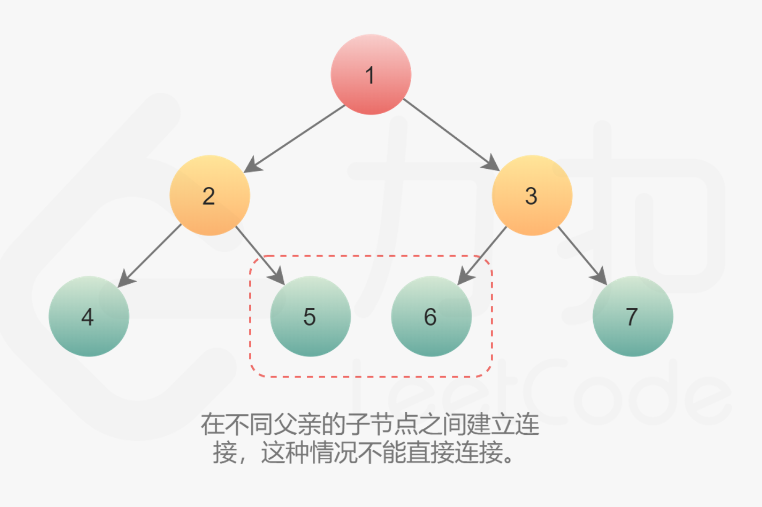

题目：

给定一个 **完美二叉树** ，其所有叶子节点都在同一层，每个父节点都有两个子节点。

二叉树节点的定义如下：

```go
struct Node {
  int val;
  Node *left;
  Node *right;
  Node *next;
}
```

填充它的每个 next 指针，让这个指针指向其下一个右侧节点。如果找不到下一个右侧节点，则将 next 指针设置为 `NULL`。

初始状态下，所有 next 指针都被设置为 `NULL`。



题解：

方式一：使用层序遍历的方式，每次都取出一层的所有节点进行next的设置


方式二：使用迭代，如下：

**这种方法只适用于每一层的第一个节点是最左侧的节点（该题目的满二叉树刚好符合），一旦每层最左侧节点 == nil , 就会被提前终止**


一棵树中，存在两种类型的 next 指针。

1. 第一种情况是连接同一个父节点的两个子节点。它们可以通过同一个节点直接访问到，因此执行下面操作即可完成连接。

```go
node.left.next = node.right
```



2. 第二种情况在不同父亲的子节点之间建立连接，这种情况不能直接连接。



但是如果每个节点有指向父节点的指针，可以通过该指针找到 next 节点，也即：

```go
node.Right.Next = node.Next.Left
```

如果不存在该指针，则按照下面思路建立连接：

```
第 N 层节点之间建立 next 指针后，再建立第 N+1 层节点的 next 指针。可以通过 next 指针访问同一层的所有节点，因此可以使用第 N 层的 next 指针，为第 N+1 层节点建立 next 指针。
```

```go
func connect(root *Node) *Node {
    if root == nil {
        return root
    }

    // 每次外循环从该层的最左侧节点开始(每次外循环都会遍历完本次的所有节点，同时为下一层所有节点设置好next指针)
    for leftmost := root; leftmost.Left != nil; leftmost = leftmost.Left {
        // 通过 Next 遍历这一层节点，同时为下一层的节点更新 Next 指针
        for node := leftmost; node != nil; node = node.Next {
            // 同一个父节点的，让左节点指向右节点
            node.Left.Next = node.Right

            // 不同父节点的，同一层的前一个父节点的右节点指向下一个父节点的左节点
            if node.Next != nil {
                node.Right.Next = node.Next.Left
            }
        }
    }

    // 返回根节点
    return root
}
```

