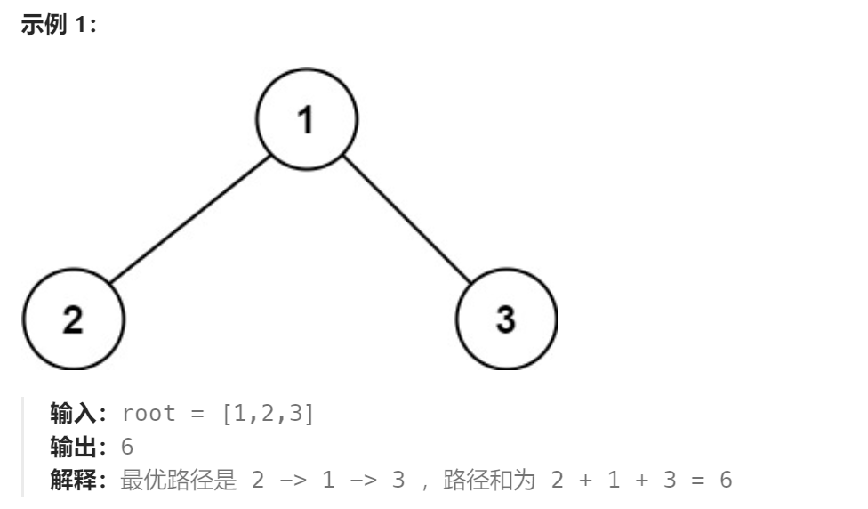
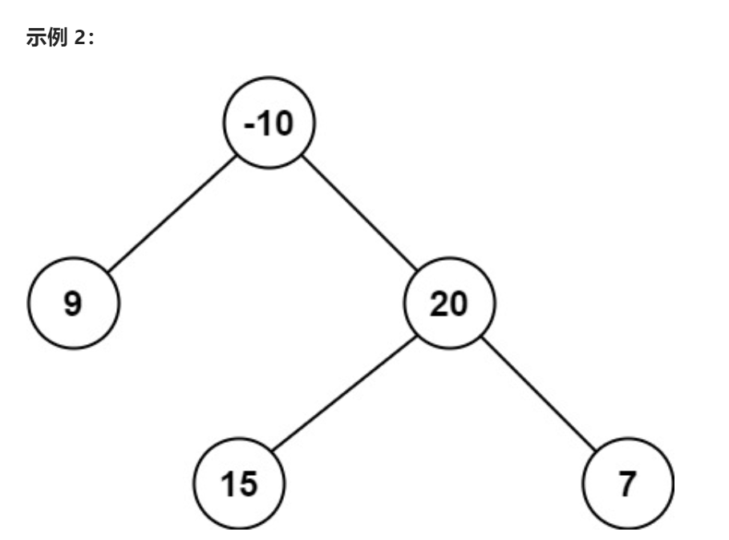

题目：

二叉树中的 **路径** 被定义为一条节点序列，序列中每对相邻节点之间都存在一条边。同一个节点在一条路径序列中 **至多出现一次** 。该路径 **至少包含一个** 节点，且不一定经过根节点。

**路径和** 是路径中各节点值的总和。

给你一个二叉树的根节点 `root` ，返回其 **最大路径和** 。





题解：

1. 每个节点向其父节点返回自己的最大贡献值：(以**该节点为路径起点**的**具有最大累计值**的路径和)
   1. 对于叶子结点来说,返回值就是自己的值(如果为负数则会返回0)
   2. 父节点在获取孩子节点的贡献值时，**必须选择非负数**，如果一个孩子节点的贡献值为负,则明显对于其父节点来说不选这个孩子节点会更好
2. 每个节点会计算经过当前节点的最大路径和 `curPathSum`，当然这个值可能不是最终的最大路径和,重要的是：
   1.  该路径经过当前节点
   2. 是经过当前节点的所有路径中最大的
   3. 如果当前 `curPathSum`，比旧的最大路径和 `maxPathSum` 更大，则更新 `maxPathSum`
3. 为什么返回值的最大贡献值必须以当前节点为路径起点(只能包含左右子树中的一个)，而不能同时包含左右子树？

​		答：如果两边都选,当前节点向自己的父节点返回时，在父节点的路径中当前节点就在这条路径中出现了两次。即： 1.在通往左边左子树的路径上出现一次  2.在通往右边右子树的路径上出现一次


```go
func maxPathSum(root *TreeNode) int {
    if root == nil {
        return 0
    }
    maxPathSum := math.MinInt  // maxPathSum用于记录递归过程中发现的最大路径和
    maxGain(root,&maxPathSum)

    return maxPathSum
}

// 返回一个节点的最大贡献值
func maxGain(root *TreeNode,maxPathSum *int) int {
    if root == nil {
        return 0
    }

    leftGain := getMax(maxGain(root.Left,maxPathSum),0) 
    rightGain := getMax(maxGain(root.Right,maxPathSum),0) 

	// 计算当前路径和
    curPathSum := root.Val + leftGain + rightGain  
    
    *maxPathSum = getMax(*maxPathSum,curPathSum)

    // 只能选一边(左子树或者右子树),这样才能以当前节点为起点
    return getMax(leftGain,rightGain) + root.Val  
}


func getMax(a,b int) int {
    if a > b {
        return a
    } else {
        return b
    }
}
```

