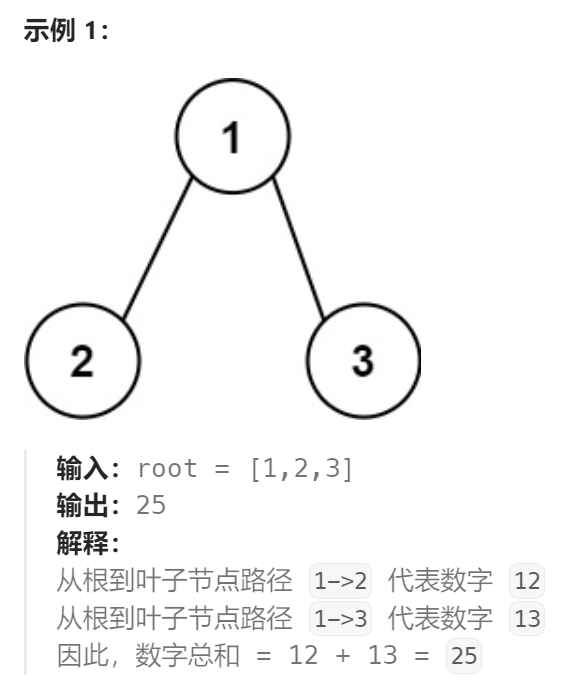
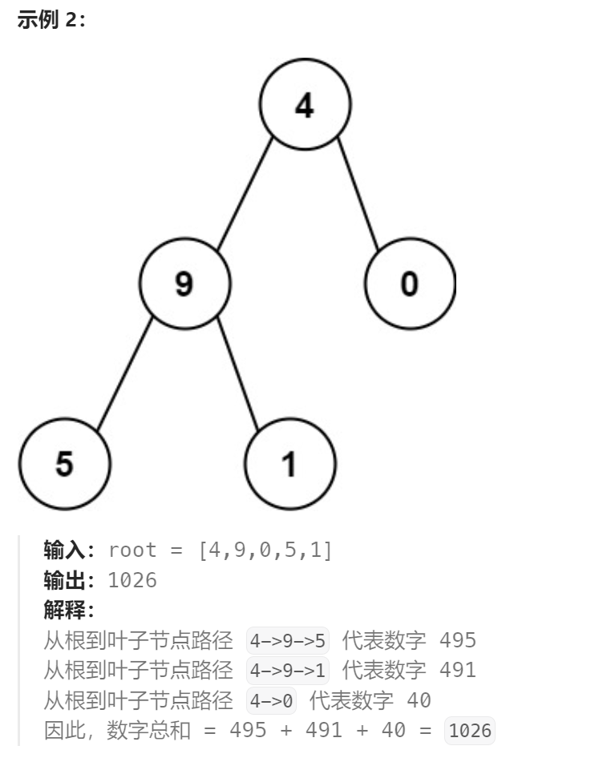

题目：

给你一个二叉树的根节点 `root` ，树中每个节点都存放有一个 `0` 到 `9` 之间的数字。

每条从根节点到叶节点的路径都代表一个数字：

- 例如，从根节点到叶节点的路径 `1 -> 2 -> 3` 表示数字 `123` 。

计算从根节点到叶节点生成的 **所有数字之和** 。

**叶节点** 是指没有子节点的节点。






题解：

方法一：

用一个切片沿途记录经过节点的值，最后到叶子结点完成本路径代表数字的计算，追加到数字总和

方法二：

仅用一个变量记录当前路径的代表数字，而不是切片。原理是每次的：

路径新值  = 路径旧值 * 10 + 当前节点的值

```go
func sumNumbers(root *TreeNode) int {
    if root == nil {
        return 0
    }
    finPathSum := 0   // 记录路径之和

    helper(root,nil,&finPathSum)  
    
    helperMemory(root, 0, &finPathSum)   // 内存优化的方法二
    
    return finPathSum
}

// 优化了使用内存，当前分支路径记录仅用一个变量实现(而非切片)
func helperMemory(root *TreeNode,curPathSum int, finPathSum *int) {
    if root.Left == nil && root.Right == nil {  // 到达叶子结点
       *finPathSum += curPathSum * 10 + root.Val
    }

    if root.Left != nil {
        helperMemory(root.Left, curPathSum * 10 + root.Val, finPathSum)
    }

    if root.Right != nil {
        helperMemory(root.Right, curPathSum * 10 + root.Val, finPathSum)
    }
}


func helper(root *TreeNode,path []int,pathSum *int) {
    if root.Left == nil && root.Right == nil {  // 到达叶子结点
        pathStr := ""
        for _,node := range path {
            pathStr += fmt.Sprintf("%d",node)
        }
        pathStr += fmt.Sprintf("%d",root.Val)

        pathVal,_ := strconv.Atoi(pathStr)
        *pathSum += pathVal
    }

    if root.Left != nil {
        curPath := make([]int,0)
        curPath = append(curPath,path...)
        curPath = append(curPath,root.Val)

        helper(root.Left,curPath,pathSum)
    }

    if root.Right != nil {
        curPath := make([]int,0)
        curPath = append(curPath,path...)
        curPath = append(curPath,root.Val)

        helper(root.Right,curPath,pathSum)
    }

}
```

