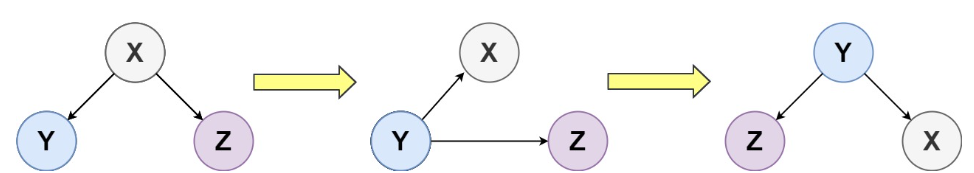
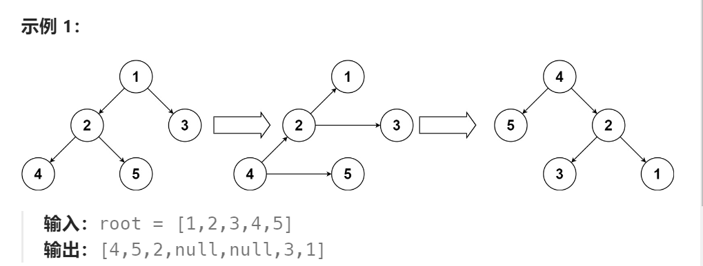

题目：

给你一个二叉树的根节点 `root` ，请你将此二叉树上下翻转，并返回新的根节点。

你可以按下面的步骤翻转一棵二叉树：

1. 原来的左子节点变成新的根节点
2. 原来的根节点变成新的右子节点
3. 原来的右子节点变成新的左子节点



上面的步骤逐层进行。题目数据保证：

1. 每个右节点都有一个同级节点（即共享同一父节点的左节点）
2. 每个右节点且不存在子节点。



题解：

比较重要的一点是：必须将变换后的旧的根节点变成一个叶子结点，否则将变成一个环(递归无法结束)

```go
func upsideDownBinaryTree(root *TreeNode) *TreeNode {
    if root == nil {    // 正常情况遍历不会遇到(因为这里的递归只对左孩子节点进行)
        return nil
    }
    if root.Left == nil && root.Right == nil { // 正常情况遍历不会遇到(因为这里的递归只对左孩子节点进行)
        return root
    }

    if root.Left != nil && root.Left.Left == nil {  //root.Left将是最左侧的叶子结点,也是新树的根节点
        root.Left.Left,root.Left.Right = root.Right,root
        newHead := root.Left   // 返回值总是这一个,新树的根节点
        root.Left,root.Right = nil,nil   // 这一条比较重要，必须将旧的根节点变成一个叶子结点
        return newHead
    }

    newHead:=upsideDownBinaryTree(root.Left)   // 所有的右孩子都没有子节点,因此只需要递归左孩子即可
    root.Left.Left,root.Left.Right = root.Right,root
    root.Left,root.Right = nil,nil
    return newHead
}

```

