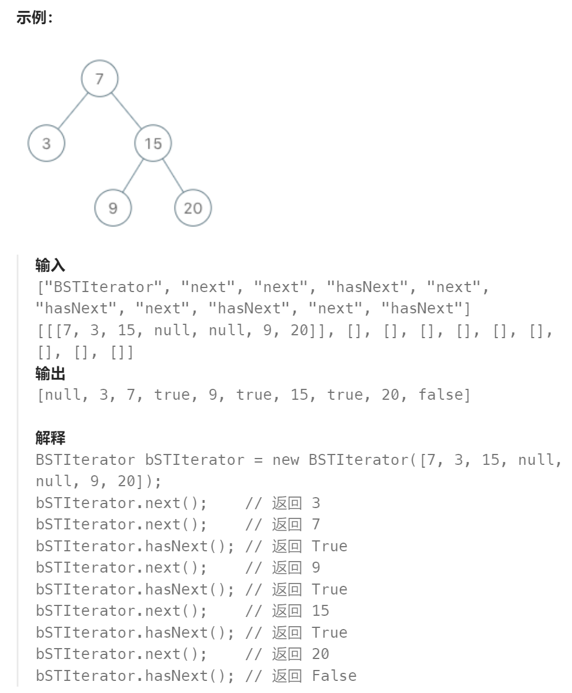

题目：

实现一个二叉搜索树迭代器类`BSTIterator` ，表示一个按中序遍历二叉搜索树（BST）的迭代器：

- `BSTIterator(TreeNode root)` 初始化 `BSTIterator` 类的一个对象。BST 的根节点 `root` 会作为构造函数的一部分给出。指针应初始化为一个不存在于 BST 中的数字，且该数字小于 BST 中的任何元素。
- `boolean hasNext()` 如果向指针右侧遍历存在数字，则返回 `true` ；否则返回 `false` 。
- `int next()`将指针向右移动，然后返回指针处的数字。

注意，指针初始化为一个不存在于 BST 中的数字，所以对 `next()` 的首次调用将返回 BST 中的最小元素。

你可以假设 `next()` 调用总是有效的，也就是说，当调用 `next()` 时，BST 的中序遍历中至少存在一个下一个数字。



题解：

方法一：先将BST进行中序遍历，保存中序遍历结果数组，提供给BSTIterator使用

方法二：可以利用栈这一数据结构，通过迭代的方式对二叉树做中序遍历。此时，我们无需预先计算出中序遍历的全部结果，只需要实时维护当前栈的情况即可。

```go
方法一：

type BSTIterator struct {
    BSTInorder []int   // 存储按照中序遍历的BST的结果
    index int  // 用于next()和hasNext()使用的索引
}


func Constructor(root *TreeNode) BSTIterator {
    if root == nil {
        return BSTIterator{
            BSTInorder:make([]int,0),
        }
    }
    bst := Inorder(root)
    return BSTIterator{
        BSTInorder: bst,
        index: -1,
    }
}
func (this *BSTIterator) Next() int {
    if len(this.BSTInorder) == 0 {
        return -1
    }

    this.index++
    return this.BSTInorder[this.index]
}

func (this *BSTIterator) HasNext() bool {
       if len(this.BSTInorder) == 0 {
        return false
    }

    if this.index + 1 <= len(this.BSTInorder) - 1 {
        return true
    } else {
        return false
    }
}

func Inorder(root *TreeNode) []int{
    if root == nil {
        return []int{}
    }
    curRes := make([]int,0)

    curRes = append(curRes,Inorder(root.Left)...)
    curRes = append(curRes,root.Val)
    curRes = append(curRes,Inorder(root.Right)...) 

    return curRes
}
```

```go
方法二：
type BSTIterator struct {
    stack []*TreeNode
    cur   *TreeNode
}

func Constructor(root *TreeNode) BSTIterator {
    return BSTIterator{cur: root}
}

// Next()方法比较奇特：
// 1.在初始时(cur == 整颗BST根节点)时会持续迭代到BST最左侧的叶子结点上，因此从 根节点 --> 最左叶子结点路径所有节点值入栈
// 2.接着弹出最左叶子结点，也就是整棵树的最小值
// 3.完成2之后，cur == nil，因此在下次调用Next时不会进行任何迭代，也即stack没有任何增加节点。并且会返回最左叶子结点的父节点，也就是最左子树的根节点(2时返回了最左子树的左孩子)，此时cur == mostLeftTree.Right，也就是最左子树的右孩子。
// 4.下层再调用Next会进行迭代，将最左子树的右子树采取和2/3相同的处理。

// 从上述步骤可以看到，Next遵循中序遍历方式，左子树 -- 根节点 -- 右子树
func (it *BSTIterator) Next() int {
    for node := it.cur; node != nil; node = node.Left {  
        it.stack = append(it.stack, node)
    }
    it.cur, it.stack = it.stack[len(it.stack)-1], it.stack[:len(it.stack)-1]
    val := it.cur.Val
    it.cur = it.cur.Right
    return val
}

// it.cur == nil 不意味着没有后续值;
// len(it.stack) == 0 不意味着没有后续值： 一开始 cur == 整棵树root , 但是 len(it.stack) == 0 
func (it *BSTIterator) HasNext() bool {
    return it.cur != nil || len(it.stack) > 0
}
```

