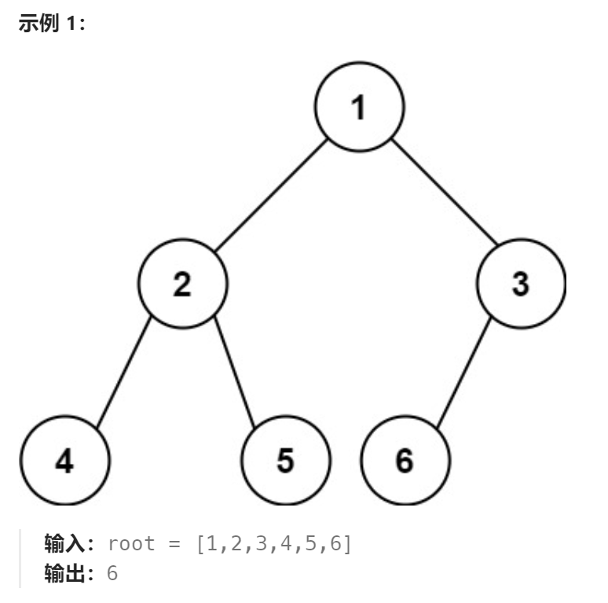

题目：

给你一棵 **完全二叉树** 的根节点 `root` ，求出该树的节点个数。

[完全二叉树](https://baike.baidu.com/item/完全二叉树/7773232?fr=aladdin) 的定义如下：在完全二叉树中，除了最底层节点可能没填满外，其余每层节点数都达到最大值，并且最下面一层的节点都集中在该层最左边的若干位置。若最底层为第 `h` 层，则该层包含 `1~ 2h` 个节点。



题解：

简单的二叉树递归固然可以做到，但是时间复杂度为 O(N) （N为二叉树节点个数）

下面给出一种给优秀的做法，利用了完全二叉树的性质：

```go
func countNodes(root *TreeNode) int {
    if root == nil {
        return 0
    }
    leftDepth := getTreeDepth(root.Left)   // 获取左子树的深度(迭代求深度, O(logN))
    rightDepth := getTreeDepth(root.Right) // 获取右子树的深度(迭代求深度, O(logN))

	return treeTotalNode(root, leftDepth, rightDepth)
}

// 对于任何一个根节点，必定是存在一个"完全"二叉树子树和一个“满”二叉树子树
// 1."满"二叉树可以依据公式直接求节点个数,因此此子树分支的时间复杂度为 O(1)
// 2."完全"二叉树则需要继续递归(继续二分下去)，此子树分支的时间复杂度是 O(logN),直到找到一个节点只有左孩子节点但没有右孩子节点
func treeTotalNode(root *TreeNode, leftDepth, rightDepth int) int {
	if root.Left == nil && root.Right == nil {
		return 1
	}
	if root.Left != nil && root.Right == nil {
		return 2
	}

	if rightDepth == leftDepth { // 右子树深度 == 左子树深度，意味着左子树必然是满二叉树，但右子树不一定是
		leftTotal := math.Pow(float64(2), float64(leftDepth)) - 1 + 1 // 左子树节点个数+根节点
		// leftTotal + 右子树个数(递归求)
		return int(leftTotal) + treeTotalNode(root.Right, getTreeDepth(root.Right.Left), getTreeDepth(root.Right.Right))
	}
	if rightDepth < leftDepth { // 右子树深度 < 左子树深度，意味着右子树必然是满二叉树，但左子树不一定是
		rightTotal := math.Pow(float64(2), float64(rightDepth)) - 1 + 1 // 右子树节点个数+根节点
		// rightTotal + 左子树个数(递归求)
		return int(rightTotal) + treeTotalNode(root.Left, getTreeDepth(root.Left.Left), getTreeDepth(root.Left.Right))
	}
	panic("二叉树并非完全二叉树") // 右子树深度 > 左子树深度(不可能出现这种情况)
}

// 获取一颗二叉树的深度
func getTreeDepth(root *TreeNode) int {
	depth := 0

	cur := root
	for {
		if cur == nil {
			return depth
		}
		depth++
		cur = cur.Left
	}
}
```

