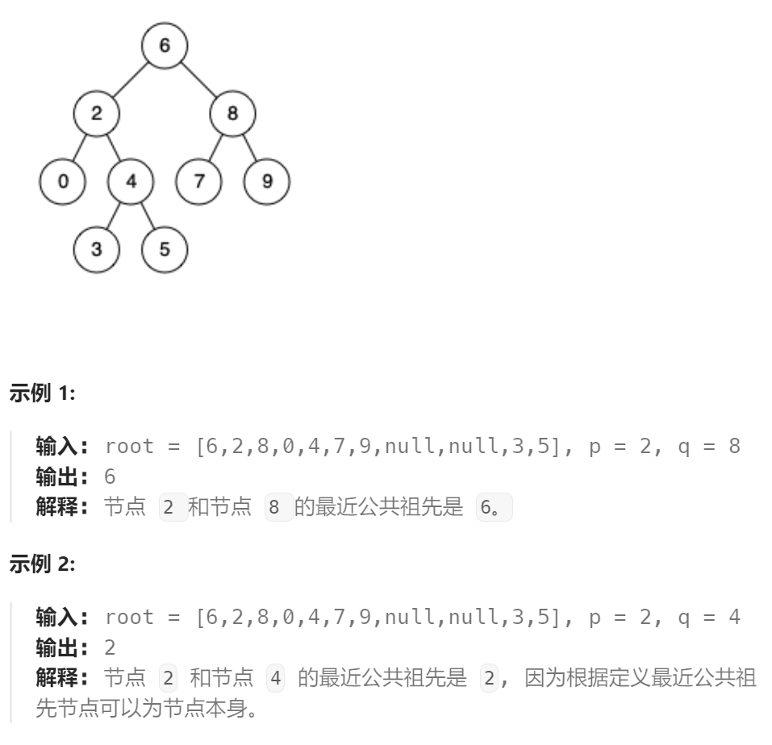

题目：

给定一个二叉搜索树, 找到该树中两个指定节点的最近公共祖先。

[百度百科](https://baike.baidu.com/item/最近公共祖先/8918834?fr=aladdin)中最近公共祖先的定义为：“对于有根树 T 的两个结点 p、q，最近公共祖先表示为一个结点 x，满足 x 是 p、q 的祖先且 x 的深度尽可能大（**一个节点也可以是它自己的祖先**）。”

例如，给定如下二叉搜索树: root = [6,2,8,0,4,7,9,null,null,3,5]



题解：

因为此树是`BST`，相比于一般的二叉树，有以下特性：

我们需要找到节点 p

- 如果当前节点就是 p，那么成功地找到了节点
- 如果当前节点的值大于 p的值，说明 p应该在当前节点的左子树，因此将当前节点移动到它的左子节点；
- 如果当前节点的值小于 p的值，说明 p应该在当前节点的右子树，因此将当前节点移动到它的右子节点。

利用上述特点，通过**迭代**即可获取公共祖先节点：

- 我们从根节点开始遍历；


- 如果当前节点的值大于 p 和 q 的值，说明 p 和 q 应该在当前节点的左子树，因此将当前节点移动到它的左子节点；


- 如果当前节点的值小于 p 和 q 的值，说明 p 和 q 应该在当前节点的右子树，因此将当前节点移动到它的右子节点；


- 如果当前节点的值不满足上述两条要求，那么说明**当前节点就是「分岔点」**。此时，**p 和 q 要么在当前节点的不同的子树中，要么其中一个就是当前节点。**


```go
func lowestCommonAncestor(root, p, q *TreeNode) *TreeNode {
    ancestor := root
    for {
        if p.Val < ancestor.Val && q.Val < ancestor.Val {
            ancestor = ancestor.Left
        } else if p.Val > ancestor.Val && q.Val > ancestor.Val {
            ancestor = ancestor.Right
        } else {
            return ancestor
        }
    }
}
```

