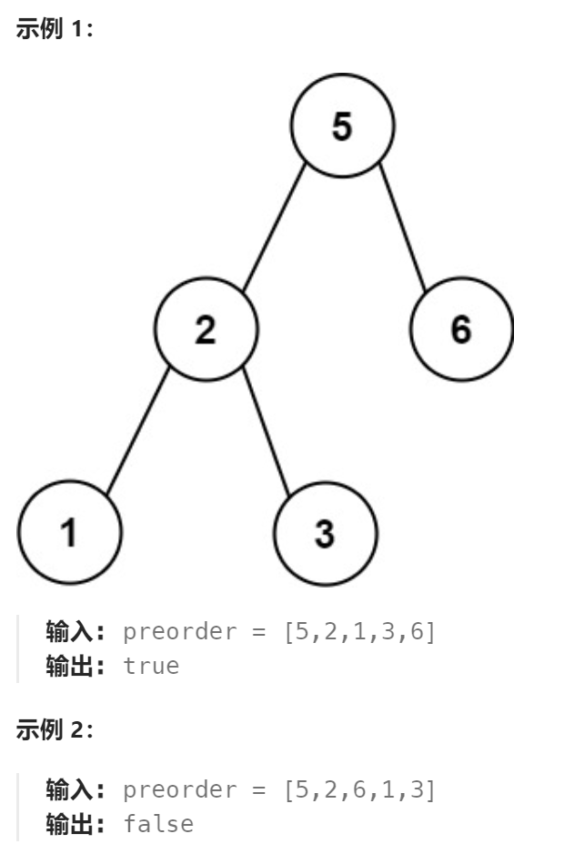

题目：

给定一个 **无重复元素** 的整数数组 `preorder` ， *如果它是以二叉搜索树的**先序遍历**排列* ，返回 `true` 。



题解：

此题的关键是察觉到：

**对于任何一个节点,其后面的先是连续的比他小的值,然后是连续比它大的值**。连续小于区域就是左子树，连续大于区域就是右子树。

**解法一：**

时间复杂度是 O(N^2)

```go
func verifyPreorder(preorder []int) bool {
    for i:=0; i<len(preorder); i++ {
        cur := preorder[i]
        // 对于任何一个节点,其后面的先是连续的比他小的值,然后是连续比它大的值
        bigStart := false
        for j:=i+1; j<len(preorder); j++ {
            next := preorder[j]
            if next > cur {
                bigStart = true
            }
            if bigStart && next < cur {  // 已经进入连续大于区域,就必然不能再出现比根节点小的值
                return false
            }
        }
    }
    return true
}
```

**解法二：**

在解法一基础上，通过引入递归，将时间复杂度降低为 O(N)

```GO
func verifyPreorder(preorder []int) bool {
	if len(preorder) == 0 || len(preorder) == 1 {
        return true
    }

    // 1. 找到右子树起点(第一个比当前根节点大的是右子树起点)
    i:=1
    for ; i<len(preorder); i++ {
        if preorder[i] > preorder[0] {
            break
        }
    }

    // 2.右子树的所有值都需要大于当前根节点
    for j:=i; j<len(preorder); j++ {
        if preorder[j] < preorder[0] {
            return false
        }
    }

    return helper(preorder[1:i]) && helper(preorder[i:])
}
```

**解法三：**

使用单调栈（TODO:）