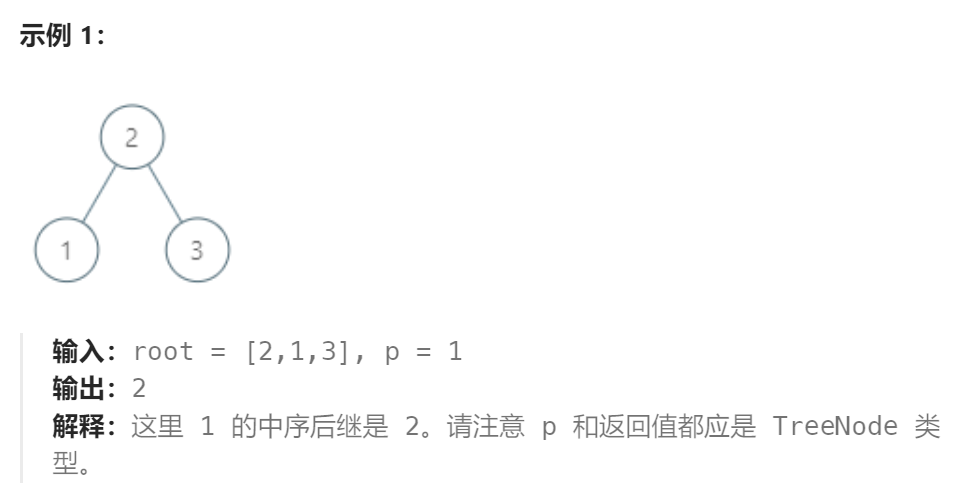
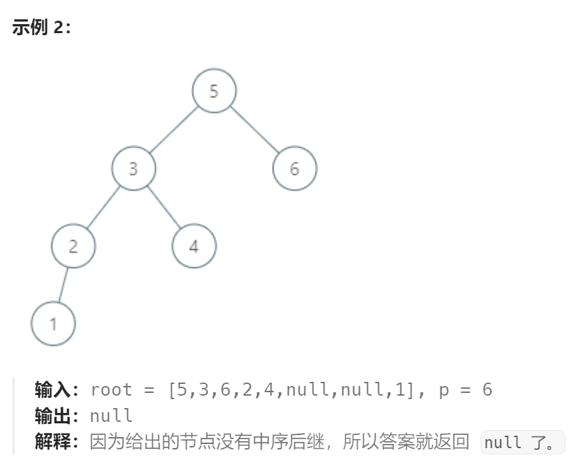

题目：

给定一棵二叉搜索树和其中的一个节点 `p` ，找到该节点在树中的中序后继。如果节点没有中序后继，请返回 `null` 。

节点 `p` 的后继是值比 `p.val` 大的节点中键值最小的节点。





题解：

在二叉树中的前驱、后继节点是指：将整个二叉树按照中序遍历的方式输出到一个数组中，节点的前驱、后继节点分别就是节点在输出数组中的前驱、后继节点。

节点X在二叉树上的后继节点：

1. X存在右子树，那么后继结点就是右子树的最左节点
2. X不存在右子树，那么让节点X向上追溯，如果追溯的过程中发现当前节点是其父节点的左孩子，那么X的后继节点就是这个父节点。
3. 对于2，有一种特殊的情况：X本身是二叉树最右边的节点。那么它采用2的方法向上追溯时，始终无法得到当前节点是其父节点左孩子的结果。考虑到这一特殊情况，必须添加限制条件：如果当前节点的父节点为空，则返回nil。

```go
func inorderSuccessor(root *TreeNode, p *TreeNode) *TreeNode {
    // 1.如果当前节点有右孩子,那么后继节点就是右子树的最左节点
    if p.Right != nil {
        return findMostLeft(p.Right)
    }

    // 2.当前节点没有右孩子,那么就需要不断向上追溯,直到出现节点是父节点的左孩子,该父节点是当前节点的后继
    // 二叉树追溯的常用方式是构建父子关系表
    parentMap := make(map[*TreeNode]*TreeNode)  // (key是当前节点,value是当前节点的父节点)
    parentMap[root] = root   // 根节点的父节点就是自己
    createParentMap(root, parentMap)

    return findSuccessor(p,parentMap)
}

func findSuccessor(p *TreeNode,parentMap map[*TreeNode]*TreeNode) *TreeNode {
    cur := p 
    for {    // 借助于父子关系表进行追溯
        if parentMap[cur] == cur  {     // 直到根节点也没有找到后继节点
            return nil
        }
        if parentMap[cur].Left == cur {   // 自己是父节点的左孩子节点,则找到了最终的后继节点
            return parentMap[cur]
        }
        cur = parentMap[cur]
    }
}


func findMostLeft(root *TreeNode) *TreeNode {
    mostLeft := root
    for {
        if mostLeft.Left == nil {
            return mostLeft
        }
        mostLeft = mostLeft.Left
    }
}


func createParentMap(root *TreeNode,parentMap map[*TreeNode]*TreeNode) {
    if root == nil || (root.Left == nil && root.Right == nil) {   // 直到空节点或叶子结点才结束
        return
    }
    if root.Left != nil {
        parentMap[root.Left] = root
    }
    if root.Right != nil {
        parentMap[root.Right] = root
    }
    createParentMap(root.Left, parentMap)
    createParentMap(root.Right, parentMap)

    return
}
```

