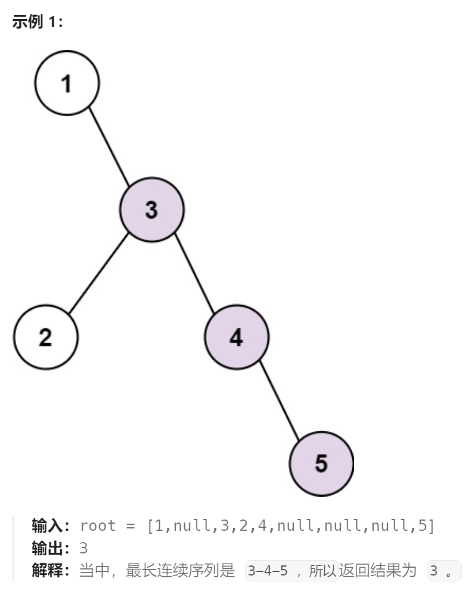
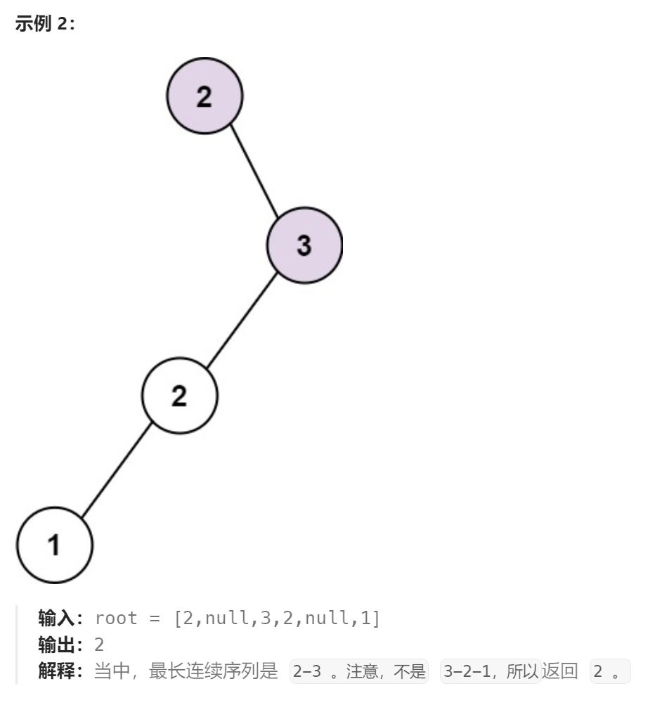

题目：

给你一棵指定的二叉树的根节点 `root` ，请你计算其中 **最长连续序列路径** 的长度。

**最长连续序列路径** 是依次递增 1 的路径。该路径，可以是从某个初始节点到树中任意节点，通过「父 - 子」关系连接而产生的任意路径。且必须从父节点到子节点，反过来是不可以的。





题解：

**方法一：直接记录所有可能的路径，最后找出最长的一条（严重超时超内存）**

每一条路径都用一个slice保存，每一条结束的路径都存储在全局变量`allPath`中。最后从`allPath`中找出最长的路径长度

超内存：使用了大量数组。

超时间：在递归函数内部存在耗时的切片操作，导致整体时间很长。

```go
func longestConsecutive(root *TreeNode) int {

    allPath := make([][]int, 0)

    helper(root, []int{}, &allPath)

    maxLen := math.MinInt
    for _,path := range allPath {
        if len(path) > maxLen {
            maxLen = len(path)
        }
    }
    if maxLen == math.MinInt {
        maxLen = 1
    }

    return maxLen
}

func helper(root *TreeNode, oldPath []int, allPath *[][]int) {
    if root == nil {  // 到达空节点,路径结束
        return
    }

    curVal := root.Val
    curPath := []int{}

    // 如果当前节点与其父节点能保持连续+1关系,就继承已有路径;否则,开辟新的路径
    if len(oldPath) != 0 && curVal == oldPath[len(oldPath)-1] + 1 {   
        curPath = append(curPath,oldPath...)
    } else if len(oldPath) > 1 {   // 不能保持连续路径,那么将长度>=2的旧路径进行记录
        (*allPath) = append((*allPath),oldPath)
    }
    curPath = append(curPath,curVal)

    if root.Left == nil && root.Right == nil {   // 当前节点是叶子结点
        if len(curPath) != 1 {
            (*allPath) = append((*allPath),curPath)  // 将长度 > 1 的路径追加到全局变量allPath中
        }
        return
    }

    helper(root.Left, curPath, allPath)
    helper(root.Right, curPath, allPath)

    return
}
```

**方法二：不保存完整路径，而是只需要路径的长度**

存在一个全局变量`maxLen`，在递归过程中一旦遇到比已有`maxLen`还要大的路径长度，就用该路径长度更新`maxLen`

使用了一点**回溯**的知识，每个节点需要向上回溯得到父节点的值。**只不过这里每个节点只依赖于自己的父节点,因此不需要传递整个父子关系表,只需传递父节点即可**

```go
func longestConsecutive(root *TreeNode) int {

    maxLen := math.MinInt
    helper(root, root, 0, &maxLen)

    return maxLen
}

// 也是采用回溯的策略,只不过这里每个节点只依赖于自己的父节点,因此不需要传递整个父子关系表,只需传递父节点即可
func helper(root *TreeNode, parent *TreeNode, curLen int, maxLen *int) {
    if root == nil {
        return 
    }

    if root.Val == parent.Val + 1 {   // 当前节点比起父节点大1
        curLen++   // 路径长度++
    } else {   // 中断了,保存旧的最大路径
        (*maxLen) = getMax((*maxLen), curLen)
        curLen = 1   // 路径长度重新开始计数
    }

    if root.Left == nil && root.Right == nil {   // 叶子结点,将是路径的终点
        (*maxLen) = getMax((*maxLen), curLen)
    }

    helper(root.Left, root, curLen, maxLen)
    helper(root.Right, root, curLen, maxLen)

    return
}

func getMax(a,b int) int {
    if a > b {
        return a
    } else {
        return b
    }
}
```

**方法三：优化递归函数，进一步降低时间消耗**

对于每颗子树，返回当前子树上最长路径的长度，**递归函数内部省去了对`maxLen`的操作，从而降低了单次递归所需要的时间**

**对于递归问题，如果都需要遍历相同数量的节点数，那么单次递归所消耗的时间越少（减小递归函数内部的复杂耗时操作）整体的时间消耗就越小**

```go
func longestConsecutive(root *TreeNode) int {
    return helper1(root, root, 0)
}

// 采用纯递归的方式,每次都返回当前子树上最长路径的长度
func helper1(root *TreeNode,parent *TreeNode,curLen int) int {
    if root == nil {
        return 0
    }

    if root.Val == parent.Val + 1 {   // 可以延续路径
        curLen++
    } else {   // 不能延续
        curLen = 1
    }

    leftLen := helper1(root.Left, root, curLen)
    rightLen := helper1(root.Right, root, curLen)

    return getMax(getMax(leftLen,rightLen),curLen)
}
func getMax(a,b int) int {
    if a > b {
        return a
    } else {
        return b
    }
}
```

