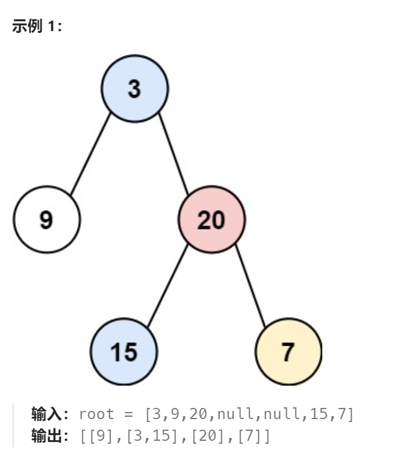
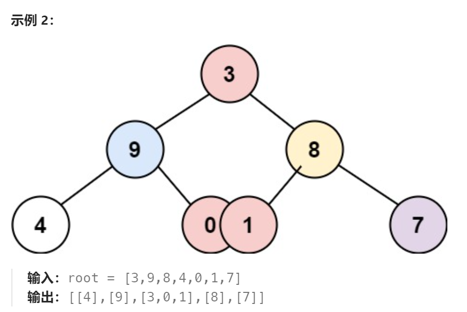

题目：

给你一个二叉树的根结点，返回其结点按 **垂直方向**（从上到下，逐列）遍历的结果。

如果两个结点在同一行和列，那么顺序则为 **从左到右**。





题解：

我们已知的二叉树遍历方式有：前序，中序，后序，层序遍历。那么这种垂直遍历，也应当是某种已知方法的变体。

我们不妨从图上来理解问题：

- 按照题意，那么我们不妨以**根结点为原点**，设**根结点的位置为第0列**

- 根节点左侧**列位置**依次**减1**，右侧依次**加1**
- 每一列都用一个列表来存储从上到下的节点
- 所有列的列表存储在一个哈希表中（key为列号，value为此列的列表）


```go
func verticalOrder(root *TreeNode) [][]int {
    if root == nil {
        return [][]int{}
    }

    q := []*TreeNode{root}   // 用于层序遍历二叉树的队列
    posQ := []int{0}   // q中每个节点所在的列号(根节点为基准,作为第0列)

    colMap := make(map[int][]int)   // 每一列都是一个链表,按照从上到下顺序保留此列的节点的节点值
    mostLeftCol := math.MaxInt   // 用来保存二叉树最左侧的列号 

    // 对二叉树进行层序遍历
    for len(q) > 0 {
        // 取出一个子树根节点
        node := q[0]
        q = q[1:]
        // 取出该节点所在列号
        nodePos := posQ[0]
        posQ = posQ[1:]
        // 将节点追加到对应列的链表上
        colMap[nodePos] = append(colMap[nodePos],node.Val)  

        // 节点左孩子入队列,左孩子位于当前节点的左侧，列号 = 当前列号 - 1
        if node.Left != nil {
            q = append(q,node.Left)
            posQ = append(posQ,nodePos-1)
        }

        // 节点右孩子入队列,右孩子位于当前节点的右侧，列号 = 当前列号 + 1
        if node.Right != nil {
            q = append(q,node.Right)
            posQ = append(posQ,nodePos+1)
        }  

        // 更新mostLeftCol
        mostLeftCol = getMin(mostLeftCol, nodePos)
    }

    res := make([][]int,0)
    // end - start + 1 = len, 所以 end = len - 1 + start
    for i:=mostLeftCol; i<= len(colMap) -1 + mostLeftCol; i++ {  // 从左到右遍历所有列
        res = append(res , colMap[i])  // 每次追加一列
    }
    return res
}

func getMin(a,b int) int {
    if a < b {
        return a
    } else {
        return b
    }
}
```

