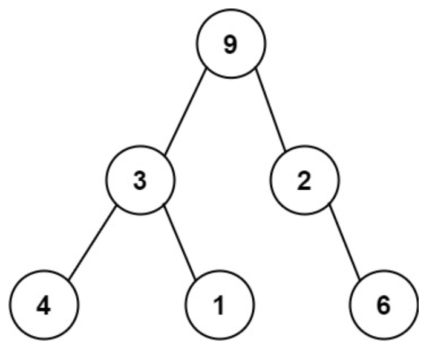
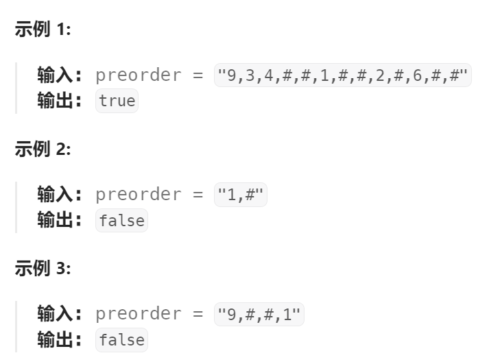

题目：

序列化二叉树的一种方法是使用 **前序遍历** 。当我们遇到一个非空节点时，我们可以记录下这个节点的值。如果它是一个空节点，我们可以使用一个标记值记录，例如 `#`。



例如，上面的二叉树可以被序列化为字符串 `"9,3,4,#,#,1,#,#,2,#,6,#,#"`，其中 `#` 代表一个空节点。

给定一串以逗号分隔的序列，验证它是否是正确的二叉树的前序序列化。编写一个在不重构树的条件下的可行算法。

**保证** 每个以逗号分隔的字符或为一个整数或为一个表示 `null` 指针的 `'#'` 。

你可以认为输入格式总是有效的

- 例如它永远不会包含两个连续的逗号，比如 `"1,,3"` 。

**注意：**不允许重建树。



题解：

我们可以定义一个概念，叫做槽位。一个槽位可以被看作「当前二叉树中正在等待被节点填充」的那些位置。

二叉树的建立也伴随着槽位数量的变化。每当遇到一个节点时：

**如果遇到了空节点，则要消耗一个槽位；**

**如果遇到了非空节点，则除了消耗一个槽位外，还要再补充两个槽位。**

此外，还需要将**根节点作为特殊情况处理**。（根节点只有一个，因此栈在初始化时栈顶元素只有一个槽位，这是为根节点准备的）


我们使用栈来维护槽位的变化。**栈中的每个元素，代表了对应节点处剩余槽位的数量**，而**栈顶元素就对应着下一步可用的槽位数量**。当遇到空节点时，仅将栈顶元素减 1 ；当遇到非空节点时，将栈顶元素减 1  后，再向栈中压入一个 2 。**无论何时，如果栈顶元素变为 0 ，就立刻将栈顶弹出。**

1. 遍历结束后，若栈为空，说明没有待填充的槽位，因此是一个合法序列；
2. 遍历结束后，若栈不为空，则序列不合法。
3. 此外，在遍历的过程中，若槽位数量不足，则序列不合法。

```go
func isValidSerialization(preorder string) bool {
    n := len(preorder)  // 字符串的总长度(包括分隔符',')

    stack := []int{1}  // 模拟一个栈。初始栈中只有一个元素,值 == 1是因为提供给根节点使用的(根节点只有一个)

    for i:=0; i<n; i++ {  // 按字符遍历整个编码字符串，需要注意有的数字会占据多个字符，需要将其视为一个整体
        if len(stack) == 0 {   // 在遍历完前序字符串前,栈不能为空
            return false
        }

        if preorder[i] == ',' {  // 当前字符为分隔符，跳过即可
            continue
        } else if preorder[i] == '#' {   // 表示空节点，消耗栈顶元素一个槽位
            stack[ len(stack)-1 ]--

            if stack[ len(stack)-1 ] == 0 {  // 栈顶元素槽位 == 0,槽位消耗殆尽,弹出该元素
                stack = stack[:len(stack)-1]
            } 
        } else {   // 表示正常节点.消耗栈顶元素一个槽位,同时栈中新加一个新的元素(有两个槽位)
            
            // 因为每次读取字符串的一位，但是一个数字可能占据好几个字符，比如922占据三个字符
            // 因此必须连续的数字字符视为同一个数字
            for i < n && preorder[i] != ',' {
                i++
            }
            stack[ len(stack)-1 ]--
            if stack[ len(stack)-1 ] == 0 { 
                stack = stack[:len(stack)-1]
            }
            stack = append(stack,2)   // 栈顶新加一个有两个槽位的元素
        }
    }

    return len(stack) == 0  // 遍历完前序字符串之后,栈需要为空
}
```

