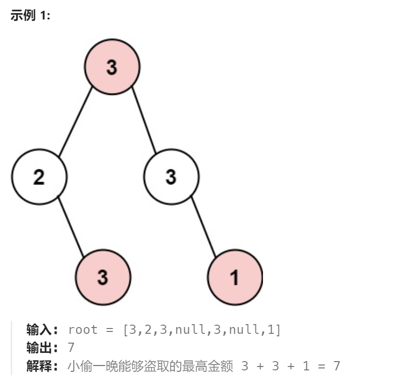
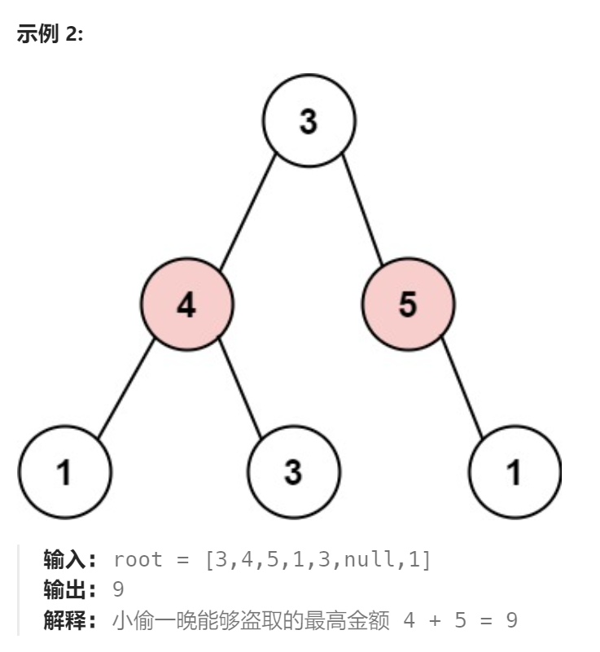

题目：

小偷又发现了一个新的可行窃的地区。这个地区只有一个入口，我们称之为 `root` 。

除了 `root` 之外，每栋房子有且只有一个“父“房子与之相连。一番侦察之后，聪明的小偷意识到“这个地方的所有房屋的排列类似于一棵二叉树”。 如果 **两个直接相连的房子在同一天晚上被打劫** ，房屋将自动报警。

给定二叉树的 `root` 。返回 ***在不触动警报的情况下** ，小偷能够盗取的最高金额* 。





题解：

解法一：递归(超时解法)

```go
func rob(root *TreeNode) int {
    if root == nil {
        return 0
    }

    // 1.如果打劫当前节点,那么该节点的孩子节点都不能打劫,只能从孙辈节点开始打劫
    jie := root.Val
    if root.Left != nil {
        jie += rob(root.Left.Left)
        jie += rob(root.Left.Right)
    }
    if root.Right != nil {
        jie += rob(root.Right.Left)
        jie += rob(root.Right.Right)
    }

    // 2.如果不打劫当前节点，那么可以从孩子节点开始打劫
    bujie := 0
    bujie += rob(root.Left)
    bujie += rob(root.Right)

    return getMax(jie,bujie)
}

func getMax(a,b int) int {
    if a > b {
        return a
    } else {
        return b
    }
}
```

解法二：递归（优化版）

通过在递归中引入更多特征值作返回值，帮助每次递归更快的做出判断。

```go
type NodeInfo struct {
    jieMax int
    bujieMax int
}

func rob(root *TreeNode) int {
    if root == nil {
        return 0
    }
    nodeInfo := helper(root)
    return getMax(nodeInfo.jieMax,nodeInfo.bujieMax)
}

func helper(root *TreeNode) NodeInfo {
    if root == nil {
        return NodeInfo{0,0}
    }
    if root.Left == nil && root.Right == nil {
        return NodeInfo{root.Val,0}
    }
    left := helper(root.Left)
    right := helper(root.Right)

    // 1.如果当前节点被劫，那么只有一种选择(不打劫孩子)
    jie := root.Val   
    jie += left.bujieMax
    jie += right.bujieMax

    // 2.如果当前节点不劫，那么有两种选择(从劫和不劫孩子中选价值最高的)
    bujie := 0    
    bujie += getMax(left.jieMax,left.bujieMax) 
    bujie += getMax(right.jieMax,right.bujieMax) 

    return NodeInfo{jie,bujie}
}

func getMax(a,b int) int {
    if a > b {
        return a
    } else {
        return b
    }
}
```

解法三：动态规划

一般如果题目使用递归出现了超时，那么此题一般就是使用动态规划才能完成。

此题的启发：**动态规划的表可以借助于递归实现（二叉树只能使用后序遍历方式，因为父节点表项依赖于其孩子节点表象）**

```GO
func rob(root *TreeNode) int {
    if root == nil {
        return 0
    }

    jieMap := make(map[*TreeNode]int)   // 记录节点被劫时,该节点对应的子树能返回的最大价值
    bujieMap := make(map[*TreeNode]int)  // 节点不被劫时,该节点对应的子树能返回的最大价值

    // nodeInfo := helper(root)
    // return getMax(nodeInfo.jieMax,nodeInfo.bujieMax)

    helperDP(root,jieMap,bujieMap)

    return getMax(jieMap[root],bujieMap[root])
}

// 动态规划问题,可以利用递归来完善使用的表
func helperDP(root *TreeNode,jieMap,bujieMap map[*TreeNode]int) {
    if root == nil {
        return 
    }
    if root.Left == nil && root.Right == nil {  // 叶子结点
        jieMap[root] = root.Val
        bujieMap[root] = 0
    }

    // 必须采用后序遍历方式来完善动态规划的两个表 jieMap和bujieMap
    // 因为父节点表项依赖于其孩子节点表象
    helperDP(root.Left,jieMap,bujieMap)
    helperDP(root.Right,jieMap,bujieMap)

    jieMap[root] = root.Val + bujieMap[root.Left] + bujieMap[root.Right]
    bujieMap[root] = getMax(jieMap[root.Left],bujieMap[root.Left]) + 
    				 getMax(jieMap[root.Right],bujieMap[root.Right])			                         

}
```

