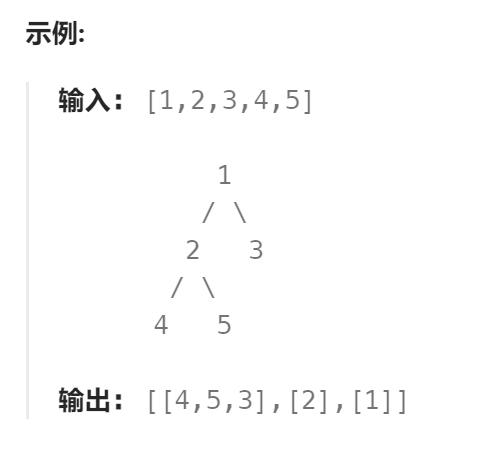

题目：

给你一棵二叉树，请按以下要求的顺序收集它的全部节点：

1. 依次从左到右，每次收集并删除所有的叶子节点
2. 重复如上过程直到整棵树为空



题解：

解决这一问题的关键是：

**反向使用二叉树高度的概念**

- 最底层的叶子结点是第一层
- `height(root) = 1 +  max( height(root.Left), height(root.Right) )`

```go
func findLeaves(root *TreeNode) [][]int {
    if root == nil {
        return [][]int{}
    }

    // 记录每一高度的所有节点的节点值(从左向右)  高度从1开始,根节点具有最大高度
    heightMap := make(map[int][]int) 
    mostHeight := createHeightMap(root,heightMap)

    res := [][]int{}

    for i:=1; i<=mostHeight; i++ {   // 从最底层开始向上遍历
        res = append(res,heightMap[i])
    }
    return res
}


func createHeightMap(root *TreeNode,heightMap map[int][]int) int {
    if root == nil {
        return 0
    }
	// 后序遍历,根节点的反向高度依赖于自己的孩子节点
    // 后序遍历的方式还直接导致每一层的叶子结点是从左到右存储在heightMap中的
    leftHeight := createHeightMap(root.Left,heightMap)
    rightHeight := createHeightMap(root.Right,heightMap)

    currentH := 1 + getMax(leftHeight, rightHeight)
    heightMap[currentH] = append(heightMap[currentH], root.Val)

    return currentH
}

func getMax(a,b int) int {
    if a > b {
        return a
    } else {
        return b
    }
}
```

